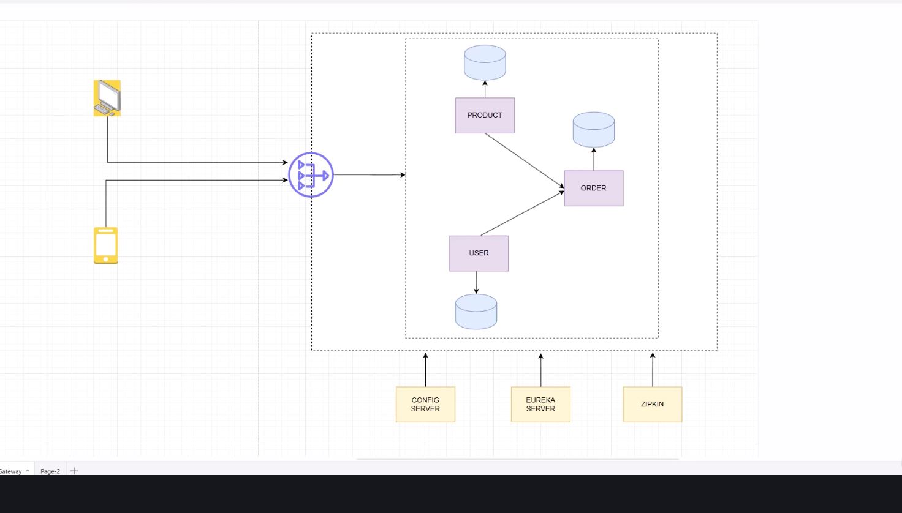

`
config management-

1)parsing and environment
2)relaxed binding (from env create java objects to use)

dev-qa-prod settings change
like different db servers etc.

1)spring boot profile
2)env vars/cli args/ext config files/jvm system vars
3)centralized spring cloud config server in microservices
(configured to pull configs from db/git/files)

4)security, like oauth client secret ids and keys
 like password in config files, need to encrypt decryot with aes etc

use hashicorp vault, aws secrets manager, kubernetes secrets

5)consistency and centralization - 
10 microservice, will have 10 yaml, no consistency
5.1)solution is spring cloud config etc.(centralized config server).
5.2)can also use git

6)dynamic updates and high availability without restarting app
-use spring cloud config server with refresh abilities

7)monitor and version the configs, rollback to prev version
-use git versioning with spring cloud config
-or kubernetes config maps

--------------

spring profiles for different env, 
db conn, log levels, app specific props
separate config for each env and dont need to update when switching
feature flags

basically manually parse the yaml using fasterxml if we want to load custom config

------------

You have this in your main application.yml:

spring:
application:
name: configdemo
profiles:
active: dev

This means:
➡️ At runtime, Spring will load application.yml first,
then merge and override it with properties from:

application-dev.yml

⚙️ If You Have Multiple Profile Files
Say your config files are:
application.yml
application-dev.yml
application-dev2.yml
application-prod.yml

Then you can activate one or more profiles in three ways:

spring:
profiles:
active: dev,dev2

➡️ Spring will load them in order
application.yml (base)
application-dev.yml
application-dev2.yml
and later files override earlier ones.
So if both have server.port, the value from application-dev2.yml wins.

Option 3 — Activate via environment or CLI
Instead of changing the YAML each time, you can run:
mvn spring-boot:run -Dspring-boot.run.profiles=dev2   //from ci pipeline
or
java -jar app.jar --spring.profiles.active=dev2
This is best for switching environments easily (e.g., dev, staging, prod).

---------------------

the -D part means:
“define a JVM property named spring.profiles.active with value dev”.

💡 How it works with Spring Boot
Spring Boot automatically reads system properties and environment variables at startup.
So:
-Dspring.profiles.active=dev
sets the active profile at runtime.

--------------------

@Value,
inject properties from ext sources ike application.properties/yml 
or env or cli args

priority
cli args "--build.id=12345"  > java sys properties "-Dbuild.id=12345
> os env vars "export build_id=12345"
> application.properties
> spring cloud config server
> default val in application code

-------------------

cnfig using env vars set

>mvn clean package   //for build jar file
>export BUILD_ID=54321
> java -jar  target/configdemo-0.0.1-SNAPSHOT.jar 

>java -Dbuild.id=9999 -Dbuild.version=1.2.3 -Dbuild.name=dev-jvm-pro -jar target/configdemo-0.0.1-SNAPSHOT.jar //jvm system properties
>java  -jar target/configdemo-0.0.1-SNAPSHOT.jar --build.id=9999 --build.version=1.2.3 --build.name=dev-jvm-pro //cli or program arguments

can set using intellij also before run (both cli and env vars)- 

 -id: 101   #can also do ${ID}, so that dont hardcode and get from env(even though @Value gets from env itslef)
 -#good for setting client secrets etc.
  
env vars
build.id=7777,build.name=dev

program/cli arguments-
--build.id=7777

-----------------------

--spring.profiles.active=prod

----------

Config Server-
-centralized and versioned configuration
-dynamic updates
-security
-application and profile specific configuration

Spring Cloud Config Server backed by Git, filesystem, db
(if git then uses version controlled systems)

-> http://localhost:8898/configdemo/default
->http://localhost:8898/configdemo/prod
//serves name of the yml file on github, and also /default is default profile as not configdemo-dev.yml

we dont need git auth as public repo and we are just pulling data

---

Config Client-
we need client talking to config server and fetching the configurations from the url

add client dependency to pom.xml of service,
and also in application.yml make config to get dependency from config server

profiles:
active: dev

//change in client whichever settings you want to pull

config:
import: optional:configserver:http://localhost:8898

//if config server down and optional , then use local config instead of restarting
//taking from application-prod.yml 

-------------

refresh scope and springboot actuator for live updates
refresh beans without restarting the server(so beans downtime?) 

normally,
any change in git app, restart the config server and also the client

Client side-
1)add actuator in the client
2)add property to application.yml
3)enable refresh scope in the bean that we want to refresh
4)send post request on actuator -  http://localhost:8080/actuator/refresh
   get the array of configs that were updated

//thus dont need to restart application, run a job that hit alls these endpoints 
//but the bean data lost
[
"build.version",
"config.client.version"
] 

Server side-
1)server pulls data from git only when client requests and serves it
//when we hit refresh endpoint of client, like a hook, then the client refreshes from spring cloud server

------

Q)Does the bean lose its state?

✅ Yes.
All beans annotated with @RefreshScope are destroyed and re-instantiated from scratch — as if Spring created them fresh.
This means:
Any in-memory data/state (maps, caches, counters, etc.) inside that bean is lost.
The new instance will have its fields re-initialized from the updated configuration properties fetched from the Config Server.
🔁 3️⃣ What about other beans that depend on this bean?

This depends on how they depend:
Dependency Type	Behavior on Refresh
Bean A → Bean B (@Autowired) and B is @RefreshScope	When B is refreshed, A will get a new proxy reference that points to the newly created B. A itself is not re-created, but its injected reference will now point to the new instance of B.

------

private repo, git token, set as env var intellij
-git permission- contents and read only

cloud:
config:
server:
git:
uri: https://github.com/abhinav455/app-configuration.git
username: ${GIT_USER}
password: ${GIT_TOKEN}

--------

store configs in mysdb

USE configdb;

CREATE TABLE properties (
ID INT PRIMARY KEY AUTO_INCREMENT,
APPLICATION VARCHAR(200),
PROFILE VARCHAR(200),
LABEL VARCHAR(200),
PROP_KEY VARCHAR(200),
PROP_VALUE VARCHAR(1000),
CREATED_AT TIMESTAMP DEFAULT CURRENT_TIMESTAMP,
UPDATED_AT TIMESTAMP DEFAULT CURRENT_TIMESTAMP ON UPDATE CURRENT_TIMESTAMP
);

INSERT INTO properties (application, profile, label, prop_key, prop_value) VALUES
('configdemo', 'prod', 'main', 'build.id', '101'),
('configdemo', 'prod', 'main', 'build.version', '1.2.3'),
('configdemo', 'prod', 'main', 'build.name', 'Database-Production-Build SERVER APPLICATION'),
('configdemo', 'prod', 'main', 'build.type', 'Database Production Build SERVER APPLICATION');

INSERT INTO properties (application, profile, label, prop_key, prop_value) VALUES
('configdemo', 'dev', 'main', 'build.id', '101'),
('configdemo', 'dev', 'main', 'build.version', '1.2.3'),
('configdemo', 'dev', 'main', 'build.name', 'Database-Development-Build SERVER DB'),
('configdemo', 'dev', 'main', 'build.type', 'Database Development Build SERVER DB');

--------

encryption using aes-

encrypt:
    key: "0E329232EA6D0D73"

add post request to http://localhost:8898/encrypt with body

{cipher}d9eebed808714977884a5980b44825a21039935ee7b189a64e831616bad57c5a1a84f949113c03c8ad538c8153cecece1dd30ce4ac78097ce4836558cd7766f4

when springboot reads this encrypted data, then it automatically 
 decrypts this due to {cipher} present at start with the key 

--------

use rsa key-pair keystore(stores encryption keys) instead of aes key string

with keytool cli cmd in jdk, generate rsa key pair(public and private key) and store in keystore

config server uses public key to encrypt, config server 
    uses private key to decrypt before sending to client 

> keytool -genkeypair \
-alias config-server-key \
-keyalg RSA \
-dname "CN=Config Server, OU=Spring Cloud, O=Company" \
-keypass mypass \
-keystore config-server.jks \
-storepass mypass \

can switch this config to git too

------------------------------

scale-

for git, server pulls on demand, 
but for files doesnt pull on demand

still for clients need to call refresh endpoint for everyone of them

spring cloud bus like kafka pub/sub
uses rabbitmq/kakfa behind the scenes

links nodes of a distributed system with lightweight message broker

 /*
 As long as Spring Cloud Bus AMQP and RabbitMQ are on the classpath any Spring Boot application will try to 
 contact a RabbitMQ server on localhost:5672 (the default value of spring.rabbitmq.addresses):
*/

rabbitmq uses ampq protocol

># latest RabbitMQ 4.x
docker run -d -it --rm --name rabbitmq -p 5672:5672 -p 15672:15672 rabbitmq:4-management

//rabbitmq:4-management is client, rabbitmq is server

add actuator and bus-amqp to server and client both

        <dependency>
            <groupId>org.springframework.cloud</groupId>
            <artifactId>spring-cloud-starter-bus-amqp</artifactId>
        </dependency>

management:
endpoints:
web:
exposure:
include: busrefresh

rabbitmq:
host: localhost
port: 5672
username: guest
password: guest

add this to server and also client dev profile as the dev profile active now

---

no dynamic server refresh currently as

search-locations: classpath:/config #in server

classpath: - files bundles and loaded at compile time, not runtime
and to update configs dynamically, need to point to external file location

//add hardcoded absolute
search-locations: file:///Users/abhinav.bhattacharje/springboot_proj/ecom_microservices/config-mgmt/configserver/src/main/resources/config

IMP-
thus server automatically always on request gives new config,
thus call busrefresh of server, server automatically sends single msg and
all clients pick/pushed to  async
thus no downtime for @RefreshScope services

after clients get refresh event, pulls new config from server

-------

IMP-
thus, maybe config is different from env vars
plug env vars inside config

-------

Prod best practise-
1)externalize config
2)use profiles
3)encrypt sensitive data
4)use secure connections
5)access control

------------------------------------------------------------------------------

Inter-Service Communication

.rest template basic http calls
.netflix oss for client side load balancing and eureka for service discovery
if multiple of instances of a service, automatically does all these with rest template calls
.openfeign, just declarative interface with annotations, converted to each rest call instead of boilerplate code
(built in support for service discovery eureka)  //like calling a java method of another class, not a rest api, just like monolith 
                                                 //userServiceClient.getUSer(id);

new clients - 
.rest client (modern resttemplate sync)
.web client(async) //completablefuture
.http interface (new declarative proxy to client like openfeign but without springcloud)
 (@HttpExchange to declare rest clients in a declarative way)
 (with webclient or restclient)

-------

reactive spring like node js event driven async

ans)
Spring WebFlux (reactive alternative to Spring MVC)

Uses:
Project Reactor (Flux / Mono)
Netty (instead of Tomcat)

Example:

@GetMapping("/hello")
public Mono<String> hello() {
return Mono.just("Hello!");
}

🆚 Blocking vs Reactive
Blocking (MVC)	Reactive (WebFlux)
Each request uses a thread	Event loop, few threads
Thread waits for DB/network	Non-blocking I/O
Hard to scale	Highly scalable
Simpler	More complex

---------

@Configuration is needed here so that Spring treats this class as a configuration class that produces Spring beans.
Let’s break it down very simply 👇

✅ Why do we need @Configuration here?
Because this class contains a method annotated with @Bean:

@Bean
public RestClient restClient(RestClient.Builder builder) { ... }

Spring needs to detect this class during component scanning, load it into the ApplicationContext, and execute the @Bean method to create the bean.
@Configuration tells Spring:

“This class contains bean definitions.
Please load it during startup and register the beans.”

-------------

WebClient - reactive spring with spring webflux and netty

In Project Reactor (used in Spring WebFlux), Mono and Flux are the two core reactive types.
Think of them as reactive equivalents of:
Mono → Optional / Future of 0 or 1 value
Flux → Stream / List of 0…N values

------------------

Service Registry - handles load balancing as well
http://host:port to http://service-name mapping
many hosts(keys), one val if same service

other services can make use of identifier url = reg.get(service-name)
and dont need to hardcode the hosturl as that may change//scale

client side load balance

fault tolerance and resilience - if no heartbeat, service registry updates the registry by itself

scalability - register/deregister new services

service monitoring and health checks - metrics

Spring Cloud Eureka/ Spring Cloud Netflix

------------------

old way - harcoded urls
    / dns-based service discovery 

 String url = "http://product-service.example.com/api/products/123";
 ProductResponse response = restTemplate.getForObject(url, ProductResponse.class);

//problem is dns caching of lcients and lack of health check and slow scaling

    / load balancers(HAProxy, F5, Nginx)

String url = "http://product-service.example.com/api/products/123";
ProductResponse response = restTemplate.getForObject(url, ProductResponse.class);

//lb routes the request to the proper client,  
//benefit is automatic load balancing, and helth chekcing
//limited auto discovery, and every request needs to be passed to lb leading to extra hop and centralized

    / config servers(spring cloud config/zookeeper)

//pull config from spring cloud server/zookeeper
//config serrver tells to hit refresh endpoint
//config server store {servicename:list<host>} mapping 
//can be made async and dynamic using spring cloud bus

-but main problem is still needed load balancer to distribute

@Value("{$product.service.url}")
private String productServiceUrl;

ProductResponse response = restTemplate.getForObject(productServiceUrl + "/api/products/123", ProductResponse.class);

new way - 
    service registry
 //cons - needs one more service that runs as service registry

------------------------------------

what is client side load balancing vs normal load balancing?

Ans)
✅ 1. Normal Load Balancing (Server-Side Load Balancing)
This is the traditional approach.

How it works
Client → sends request to Load Balancer
Load Balancer → chooses a server
LB forwards the request

Client → Load Balancer → Server A
→ Server B
→ Server C

Where the logic lives?
➡️ On the server side (load balancer) — Nginx, HAProxy, AWS ELB, GCP LB, etc.

The client doesn’t know:
How many servers exist
Which server is alive
How traffic is distributed

Pros
✔ Centralized control
✔ Easy to add/remove servers
✔ No logic needed in clients
✔ Health checks managed in LB

Cons
✖ Load balancer becomes a bottleneck
✖ Single point of failure (unless HA setup)
✖ More hops → slight network overhead

✅ 2. Client-Side Load Balancing
Here, the client chooses the server to call.

How it works
Client stores list of servers (static or from service discovery like Eureka/Consul)
Client picks a server using Round-Robin / Random / Weighted / etc.

Client → Server A
Client → Server B
Client → Server C

Where the logic lives?
➡️ Inside each client (library in code)

Examples:
Netflix Ribbon (old Spring Cloud)
Spring Cloud LoadBalancer (new)
gRPC client-side LB
Envoy + xDS (advanced)
Kubernetes kube-proxy + service mesh (partial client LB)

Pros
✔ No central load balancer needed
✔ Less network hops (faster)
✔ Better scalability for microservices
✔ Works great with service discovery

Cons
✖ Every client must implement LB logic
✖ Harder to update server lists everywhere
✖ Clients must handle failures & retries
✖ Risk of uneven balancing if clients behave differently

------------------------------------

Horizontal scale-
copy configuration(same service name, run 2 instance on different port)
 --server.port=8082 //cmd arg

and then client-service using service-discovery-service client side load balances the request
to provider-service instances

//by default, uses round robin algo

@LoadBalanced does both service discovery by service-name as host, 
    and also client load balancing

------------------------------------

when we shutdown, after heartbeat only the eureka removes services as stalenesss,
add config to gracful shutdown and inform eureka before shutting down graceful

/actuator/shutdown  //deregisters from eureka server before shutting down

/register
/heartbeat
on server

heartbeat monitor on eureka

if heartbeat missed, eureka enters into-
Self-Preservation mode-
mechanism of eureka to prevent removing unregistered instances

 ///thus eureka still shows up even if missed heartbeat as prevention of network delays etc.

threshold for missed heartbeats in self-preservation mode before eviction

eureka.server.enableSelfPreservation=true
eureka.server.self-preservation-percentage=0.85
//expected number of heartbeats per min to avoid triggering self preservation mode

eureka.instance.lease-expiration-duration-in-seconds
//interval till  lasts without heartbeat
 //before entering self preservation mode

eureka.instance.lease-renewal-interval-in-seconds=60
//how often serivce sends heartbeat

eureka.server.eviction-interval-timer-in-ms=60*1000
//interval of scheduled job that evicts the instance 
    //not getitng heartbeat even after  eureka.instance.lease-renewal-interval-in-seconds 
    // has passed

eureka.server.renewal-threshold-update-interval-ms=1560100
//sends metrics of avg heartbeats every 15 mins

http://localhost:8761/eureka/apps
http://localhost:8761/eureka/apps/CONSUMER
http://localhost:8761/eureka/apps/PROVIDER/192.168.1.4:provider:8082 
    // "/service-name/instance-id"
data in xml

Till now did service discovery and client side load balancing
next can do fault tolerance and resilience using resilience4j

-------------------------------------------------------------------------------------------------------------------------------------------------

Observability-

Logging-

  Logger logger = LoggerFactory.getLogger(OrderController.class);
    
using SLF4j+grafana-  //centralized logging

SLF4j is a logging facade, forwards to underlying logging framework
 logging framework - default is Logback
Log o/p- console/file/db

//can also use lombok for configuring logger

@SLf4j

rolling logs to discard

Grafana - data visualization and monitoring tool
observability, devops monitoring, tracking microservices

1.we dont need to push data to grafana, but grafana will do the job of reading it like logs
2.but for metrics/tracing, apps can also push to grafana opensource telemetry db
   - just install grafana agent for whichever tech you are using
   - when we load dashboard, realtime call using api to the installed agent
   - 

setup alerts or on-call and incident response
loki - logs, mimir - metric, temp - tracing

we dont need to migrate data, but can

Grafana data source plugins enable you to query data sources including time series databases like Prometheus and CloudWatch, 
logging tools like Loki and Elasticsearch, NoSQL/SQL databases like Postgres, CI/CD tooling like GitHub, and many more. 

Unlike other logging systems, Loki is built around the idea of only indexing metadata about your logs’ labels (just like Prometheus labels).
Log data itself is then compressed and stored in chunks in object stores such as Amazon Simple Storage Service (S3) or Google Cloud Storage (GCS), or even locally on the filesystem.

agents-> collect logs in grafana loki-> query using logol/logcli

---------

If you want to experiment with Loki, you can run Loki locally using the Docker Compose file that ships with Loki. It runs Loki in a monolithic deployment mode and includes a sample application to generate logs.

The Docker Compose configuration runs the following components, each in its own container:

flog: which generates log lines. flog is a log generator for common log formats.
Grafana Alloy: which scrapes the log lines from flog, and pushes them to Loki through the gateway.
Gateway (nginx) which receives requests and redirects them to the appropriate container based on the request’s URL.
Loki read component: which runs a Query Frontend and a Querier.
Loki write component: which runs a Distributor and an Ingester.
Loki backend component: which runs an Index Gateway, Compactor, Ruler, Bloom Planner (experimental), Bloom Builder (experimental), and Bloom Gateway (experimental).
Minio: which Loki uses to store its index and chunks.
Grafana: which provides visualization of the log lines captured within Loki.

https://grafana.com/docs/loki/latest/get-started/quick-start/quick-start/

make sure alloy points to application logs and it scrapes the logs from there

--------

http://localhost:3000/ -grafana url to see loki logs,
datasource loki has already been setup because of yaml configuration

select the filter as container/service, and select the container name 
 press run query

we are able to see logs of all containers

OOB alloy is configured to pick logs from docker-daemon
to pick from local filesystem, need custom configuration

alloy:
image: grafana/alloy:latest
volumes:
- ./alloy-local-config.yaml:/etc/alloy/config.alloy:ro
- /var/run/docker.sock:/var/run/docker.sock
- ../logs:/logs-parent:ro

and add to alloy-local-config to read files from here as well

> docker compose down -v
  //volumes also removed

http://localhost:12345/ //alloy url to check volumes logs data

---------------------------------------------------------

Monitoring-

performance measurements like performance, health, behavior of system
fast, memory, error

A)Grafana and Prometheus(collect and store)
 -services expose acuator endpoints for prometheus to collect periodic data
   -also alerts(optional)

//B)in loki, it took from docker socket and custom log files and db via config, 
  //stored in docker volumes, 
  //and grafana connected to that loki datasource
    //Logstash->elastisearch->kibana
    //Loki->Docker Volumes Loki Files-> minio ->Grafana
 

prometheus dependency - 
exposes micrometer(bridge between actuator and prometheus) 
  metrics in prometheus format, 
and in-memory time series db with ui and query language

expose prometheus endpoint in actuator

app -> log files -> loki ->minio -> loki -> grafana
app -> actuator-> micrometer -> prometheus -> grafana

http://localhost:8081/actuator/metrics/application.ready.time
http://localhost:8081/actuator/prometheus
http://localhost:9090/metrics
http://localhost:9090/targets?search=

-----------

Distributed Tracing -

spanid(each service)
traceid(entire request)

Zipkin is a distributed tracing tool

service and the fn that got called

Applications need to be “instrumented” to report trace data to Zipkin. 
This usually means configuration of a tracer or instrumentation library. 
The most popular ways to report data to Zipkin are via HTTP or Kafka, though many other options exist, 
such as Apache ActiveMQ, gRPC and RabbitMQ. 

The data served to the UI are stored in-memory, or persistently with a supported backend 
such as Apache Cassandra or Elasticsearch.

http://localhost:9411/zipkin/

run zipkin container
add dependency and application property to services 
    to push data to  zipkin

Need to do config to propagate traces with RestClient java

//create a tracing interceptor fn in interservice communication client
//which gets trace context and inject into http headers for next microservice

    private ObservationRegistry observationRegistry;
    //get metrics

    private Tracer tracer;
    //get trace and span id

    private Propagator propagator;
    //inject traceid in context headers to next service

add zipkin data source to grafana(prometheus and loki already configured)
http://zipkin:9411/

thus from grafana, can see loki logs, prometheus metrics, and zipkin traces

----------------------------------------------------------------------------------------------------

API Gateway

1)right now, dont want to expose endpoints to all, no centralized way
to do this, need security + auth

2)but we need centralized gateway that can route requests, instead of 
directly calling, also need server side load balanced and rate limiting
  and analytics(but better if both centralized and individual services do it)
we need single entry point for user (api gateway is also another service)

thus adds a bit complexity on the client side, thus not good

3)also eureka, not a single url for entire application, 
with service-name still need to keep track of host urls

-match routes on any request attribute
-write predicates and filters, specific to routes

need spring-cloud-starter-gateway dependency to configure our
service as a gateway

 //rabbitmq also there

this Gateway is for reactive spring,
also gateway service itself registers with eureka, and also traces to zipkin

          routes:
            - id: product-service
              #id is unique identifier given to route
              uri: http://localhost:8081
              predicates:
               #defines condition so that incoming request is a match
                - Path:

  there can be multiple predicates for each route

IMP-
1)dont need to configure eureka client unlike other services
as by default done on default eureka server port

2)zipkin also tracing done on default port

order of starting services - 
1)config service
2)eureka service discovery
3)individual services
4)gateway service

-----

Adding global filters(middleware): logging and authentication

public class LoggingFilter implements GlobalFilter {
    @Override
    public Mono<Void> filter(ServerWebExchange exchange, GatewayFilterChain chain) {
    }
}

-----

auth filter

webfilter applies filtering to all the web requests across entire app, 
global filter applies only to requests coming to/from api gateway

disable filters by commenting //@Component
 so that spring doesnt manage those beans

-------------

Http vs lb 

in gateway, we dont want to hardcode serivce uri, 
we need to do hostname as service-name picked from eureka,

cloud:
gateway:
server:
webflux:
routes:
- id: product-service
    uri: http://localhost:8081
    predicates:
    - Path=/api/products/**

uri:  lb://PRODUCT-SERVIC

thus, uri with http means discover this uri host via url and http,
do lb(specific to spring cloud) so that means discover this uri host 
     via loadbalancer/service registry,

thus can use service-name with lb

also good if we have multiple instances of service/need to load balance services

lb is config way, in code do @LoadBalanced

----

accessing eureka server from api gateway(8080 instead of 8761)

to /eureka/main , we want it to go to root eureka url not with path added

also config for static files

IMP-
api gateway doesnt redirect, but forwards request. thus domain and path same in browser
thus need to add config for static files

routing - static files use yml, dynamic custom logic etc use java code

IMP-
config server and eureka/service registry both hardcoded urls
(cant take config server host from service registry as app need to start with config before talking to 
service registry)

return builder.routes()
.route("product-service", r-> r
.path("/api/products/**")
.filters(f -> f.rewritePath("/products(?<segment>/?.*)",
"/api/products${segment}"))
.uri("lb://PRODUCT-SERVICE"))

(?<segment>...) → named capture group
/? → optional slash
.* → everything after it

----

patterns of api gateway
-backend for frontend(mobile/desktop depending on client)
-single entry point
-aggregation gateway(aggregates responses from multiple services)

--------------------------------------------------------------------------------------

Fault Tolerance

1)- service1->service2->service3 
//if they call each other directly, then service 3 fails, then  service 1 also fails
//thus use api gateway which has circuit breaker

2)- service1->gateway service->service2->gateway service -> service3
//gateway has circuit breaker implemented for each service, if something fails in between, 
- then the circuit breaker for that service triggered and gateway returns null response instead of 
- relaying the request to service
//main thing is network latency leads to cascading failures

solution1)
retry with fallback mechanism, 
timeouts and connection error handling
rate limiting
bulkhead //pattern to isolate parts of system, 
         //so one crash wont affect others
service discovery and load balance to find healthy instance of one service, 
circuit breaker for a particular service
graceful degradation

reason - too many requests, slow db query, external api delays

solution2)
caching, async processing using messaging queues, 
timeouts and fallbacks(dafault responses/data from secondary source)

resilience4j
-Retry
-RateLimiter
-Bulkhead(isolate failures and prevents cascading, by 
 limit amount of parallel executions or concurrent calls 
 so that system resources are not exhausted)
-CircuitBreaker

---

cartservice-> product and user service, add circuit breaker

/actuator/health/circuitBreakers

/actuator/busrefresh

-----
Q)but it works if we have file::// and not class_path:

✅ Native mode with file:// works,
❌ Native mode with classpath: does not work
…but that does NOT mean file-based native mode does auto-refresh.

Let me explain clearly — this is where many developers get confused.
✅ What works with file://… in Native Mode

When you use:
spring.cloud.config.server.native.search-locations: file:///…/config

Then:
✔ Config Server reads the files from the filesystem
✔ You can modify the file
✔ If you call:
POST /actuator/refresh

on the client, NOT on config server
→ The client will fetch the updated values

As long as:
The config file on disk has changed
The client asks for refresh
The client uses /actuator/refresh OR /actuator/busrefresh event

But…
❌ What does NOT happen in native mode (file://)
❌ Config Server does NOT auto-detect file changes
❌ Config Server does NOT broadcast changes to Spring Cloud Bus
❌ /actuator/busrefresh on Config Server does NOT reload files
❌ No new bus event is produced by the Config Server itself

Native mode = static file loading.
Files are only read:

at startup
OR if a client explicitly requests a refresh and the file changed

🧠 Why does file:// appear to work?
Because clients fetch fresh values when they call /actuator/refresh.
Clients always ask Config Server:

GET /{application}/{profile}/{label}

This endpoint reads the file again, even in native mode.
So clients get new config on demand, not automatically.

🚨 BUT Config Server never pushes updates automatically to the bus.
That’s the key point.

Config Server reads config only when a CLIENT requests it
NOT when you trigger a bus event on the server.

/busrefresh does NOT reload properties inside Config Server
It only broadcasts "all clients should refresh".

Config Server is STATeless
Spring Cloud Config Server never keeps configuration in memory.

Client is missing @RefreshScope
Even if the bus event is received, nothing actually updates unless the beans have:
@RefreshScope
Otherwise Spring treats them as static singletons and does NOT rebind values.
Often the event is arriving, but no properties are updatable due to missing @RefreshScope.

-----

{
"circuitBreakers": {
"productService": {
"failureRate": "-1.0%",
"slowCallRate": "-1.0%",
"failureRateThreshold": "50.0%",
"slowCallRateThreshold": "100.0%",
"bufferedCalls": 0,
"failedCalls": 0,
"slowCalls": 0,
"slowFailedCalls": 0,
"notPermittedCalls": 0,
"state": "CLOSED"} } }

--

//service
@CircuitBreaker(name="productService", fallbackMethod = "addToCartFallBack")
public boolean addToCart(String userId, CartItemRequest request) {
}

public boolean addToCartFallBack(String userId, CartItemRequest request, Exception e){
System.out.println("FALLBACK CALLED");
return false;
}

//controller
@PostMapping
public ResponseEntity<String> addToCart(
@RequestHeader("X-User-ID") String userId,
@RequestBody CartItemRequest request){

        if(!cartService.addToCart(userId, request)){
            return ResponseEntity.badRequest().body("Product Out of Stock or User Not Found or Product Not Found");
        }
        return ResponseEntity.status(HttpStatus.CREATED).build();
    }

--

if fallback called(exception thrown) then also circuit breaker failure count increases

WARN 56492  [order-service]  o.s.c.l.core.RoundRobinLoadBalancer : No servers available for service: user-service
FALLBACK CALLED
java.lang.IllegalArgumentException: Service Instance cannot be null, serviceId: user-service
at org.springframework.cloud.loadbalancer.blocking.client.BlockingLoadBalancerClient.execute(BlockingLoadBalancerClient.java:98)
at org.springframework.cloud.client.loadbalancer.RetryLoadBalancerInterceptor.lambda$intercept$2(RetryLoadBalancerInterceptor.java:122)

----

till now we did circuitbreaker at service level,
now do at api gateway service level, normal only
just create a circuit breaker for each service

//if order fails because of user, and order doesnt have 
//   its own circuit breaker for user, then api gateway trips 
//   both order and user service circuit breaker as both cause failure

can handle lot of stuff at gateway levle itself without routing to 
chain of services which break/handle circuit breaking at end
centralized place

spring-cloud-starter-circuitbreaker-reactor-resilience4j
for reactive spring with circuit breaker(like reactive api gateway)

@RestController
public class FallbackController {

	@GetMapping("/fallback/products")
	public ResponseEntity<List<String>> productsFallback(){
		return ResponseEntity.status(HttpStatus.SERVICE_UNAVAILABLE)
				.body(Collections.singletonList("Product service is unavailable, please try after sometime"));
	}

}

@Configuration
public class GatewayConfig {
	@Bean
	public RouteLocator customRouteLocator(RouteLocatorBuilder builder){

		return builder.routes()
				.route("product-service", r-> r
						.path("/api/products/**")
//						.filters(f -> f.rewritePath("/api/products(?<segment>/?.*)",
//								"/api/products${segment}"))
                        .filters(f -> f
                            .circuitBreaker(config -> config
                                .setName("ecomBreaker")
                                .setFallbackUri("forward:/fallback/products")))
                        .uri("lb://PRODUCT-SERVICE"))

thus can control which status and message to show if service error in api gateway,
also added circuit breaker

method level circuit breaker vs gateway level circuit breaker both configured

-------

Retry - ioexception, sqlexception trigger retry 

at gateway level, retry only triggers for 5xx error
retry does not trigger if service instance is not available, or host is unreachable, or load balancer cannot resolve service
//but at service level retry tiggers

if at gateway level want to retry if service is down, then circuit breaker is the way forward

	public RouteLocator customRouteLocator(RouteLocatorBuilder builder){

		return builder.routes()
				.route("product-service", r-> r
						.path("/api/products/**")
//						.filters(f -> f.rewritePath("/api/products(?<segment>/?.*)",
//								"/api/products${segment}"))
                        .filters(f-> f
                            .retry(retryConfig -> retryConfig
                                .setRetries(10)
                                .setMethods(HttpMethod.GET)
                            )
                            .circuitBreaker(config -> config
                                 .setName("ecomBreaker")
                                 .setFallbackUri("forward:/fallback/products")))
                        .uri("lb://PRODUCT-SERVICE"))

thus circuit breaker for all exception and 500 error and retry error
retry for exception before it moves to circuit breaker

IMP-
buffered call in circuit breaker means the runtime exception 5xx error 
    that retry also handles, 
failure means that service not found etc.

1)Retry when service throws error/exception 5xx, 
2)When service is down, best way is circuit breaking

--------------

Rate Limiting

server responds 429 to request limit exceeded

apache jmeter, load testing, trigger requests in bulk using multithreads
//from multiple ips in cloud - paid softwares for load testing

in jmeter, create a thread group and http request sampler

ratelimiting for service

@RestController
@RefreshScope
public class MessageController {

    @Value("${app.message}")
    private String message;

    @GetMapping("/message")
    @RateLimiter(name = "rateBreaker", fallbackMethod = "getMessageFallback")
    public String getMessage(){
        return message;
    }

	public String getMessageFallBack(Exception e){
		return "Hello Fallback";
	}

}

-------

Rate Limiting for gateway

spring cloud webflux-
RequestRateLimiter GatewayFilter Factory

The Redis RateLimiter, instead of resilience4j

uses redis as in memory db, token bucket algo with replenish rate, burst/bucket capacity etc

run redis in docker, and gateway service interacts with redis to store data

---------------------------------------------------------------------------------------------

Async Communication

exchange is something that gets message, 
  based on routing rules passes it to the queues

exchange does binding with the queues

normal queue - stores till msg received 
streams - stores even after received so that reread by the offset again, can go back and forward
          stores till the store time set

message exchange types-
1)direct message exchange
(based on routing key, one queue that exactly matches routing)
2)fanout
3)topic //based on patterns in routing keys //eg- app.order.#
4)header //based on key value pair in header {type: "gold", customer: "premium"} 

can see binding, routing key etc in gui

durable queue means survives server restarts

RestTemplate is used to send msg over rabbitmq

		rabbitTemplate.convertAndSend("order.exchange",
				"order.tracking",
				Map.of("orderId", savedOrder.getId(),   //key1, val1
						"status", "CREATED")            //key2, val2
		);

IMP-
as we need to meantion where we are sending that message
(and which key, so that the exchange routes to the exact queue)

we cant send to queue(unlike channel in kafka), send to exchange,
and with the help of key, exchange sends to queue
(as topicexchange created Binding to queue with the help of Key)

E(v,u,w)
Binding(Exchange, Queue, Key)

--------------

Jackson is a very popular Java JSON library used for:

✅ 1. Converting Java Objects ↔ JSON (Serialization & Deserialization)
Serialization → Java object → JSON string
Deserialization → JSON string → Java object

Example:
ObjectMapper mapper = new ObjectMapper();
String json = mapper.writeValueAsString(myObject);  // serialization
MyClass obj = mapper.readValue(json, MyClass.class); // deserialization
OR
Map<String, Object> objMap = mapper.readValue(json, Map.class);

Object obj = mapper.readValue(json, Object.class);
If json is an object → result is a Map
If json is an array → result is a List
If primitive → result is a primitive

✅ 2. Used by Spring Boot
Spring Boot uses Jackson by default to:
parse incoming JSON requests into Java DTOs
convert Java objects into JSON responses

Example:
@PostMapping("/user")
public User create(@RequestBody User user) {
return user;  // Spring uses Jackson to convert it to JSON
}

---------------

Q)rabbirtmq listener what happens in consumer? does it acts like a server on some port at which rabbitmq pushes? 

Great question — and very common confusion.
Here’s the clear explanation:

❓ Does a RabbitMQ consumer act like a server listening on a port?

No.
A RabbitMQ consumer does NOT open a server socket or port.
RabbitMQ consumers don’t behave like HTTP servers.
They do not say:
“I am listening on port 9000, send me messages.”
Instead, consumers connect outbound TO RabbitMQ (on AMQP port 5672) and RabbitMQ delivers messages through that connection.

✅ How RabbitMQ Consumer Works (Correct Mental Model)
1. Consumer makes a TCP connection → to RabbitMQ
This is an outgoing connection (client → server).
RabbitMQ server runs on:
localhost:5672   (AMQP)

The consumer uses:
connection = factory.newConnection();
channel = connection.createChannel();

2. Consumer sends a “SUBSCRIBE” (basic.consume) request
The code looks like:
channel.basicConsume("queueName", false, consumer);

This tells RabbitMQ:
“Please start sending me messages from queue X on this channel.”

3. RabbitMQ pushes messages over the same TCP channel
There is no new port.
No server is started on the consumer side.
RabbitMQ server pushes messages on the AMQP channel that the consumer already opened.
Think of it like a long-lived WebSocket.

⚡ Push vs Pull in RabbitMQ
RabbitMQ uses Push model
RabbitMQ pushes messages to consumers automatically.
Not pull.

But… consumers can control flow using:
prefetch count (QoS)
→ to tell RabbitMQ how many messages to push at once

acknowledgements
→ so messages are not lost

🔥 What happens inside a RabbitMQ listener (Spring Boot example)
@RabbitListener(queues = "orderQueue")
public void processOrder(Order order) {
// called whenever a message arrives
}

Spring does:
Creates a connection → to RabbitMQ
Creates a channel
Calls basicConsume()
Sits idle
(RabbitMQ pushes messages whenever they arrive)
Method gets invoked automatically
Spring sends ACK back after the method succeeds

No port opened.
No server started.
The connection is client → server, not server → client.

---------------------

even if notif service down, once it gets back up, gets the message
no decoupling

use DTO instead of directly sending key value pair in map 
and consumer side also

aws marketplace, saas on aws, just invoice order etc on aws,
from seller page only everything happens, aws just infra and billing
- cloudamqp on aws

virtual host - namespace inside rabbitmq
in free tier, in a single cluster/host, 
   queues/exchanges are created in same host
   thus virtual host for us
make use of remote cloud server

---------------------------------

Kafka

Kafka vs RabbitMQ side-by-side
Feature	     RabbitMQ	                 Kafka
Model	       Push	                        Pull
Consumer	Long-lived open TCP subscription	Consumer polls
Message Store	Yes (Queue)	              Yes (Topic log)
Delivery	Fast but memory-limited	        Durable, scalable
Fire-and-forget	 Supported (no ACK mode)	 Supported
msg removed once acked         each consumer group can read independently with offset
task/short lived jobs                    high throughput, real time
short term delivery                          long term storage and replay   
no string ordering unless manually handles    guarantees ordering(within partition)  
high thorughput(streaming big data)          moderate

Below are the only 4 ways systems communicate-
1)rabbitmq/sqs - msg queue
2)event streaming - kafka
3)batch processing - scheduled jobs/spark
4)api call - rest/rpc/websocket

event streaming(log based)
stores events in real time in a log

-----

Kafka Architecture

event is something happened + its data

topic/channel like a wa group,
when we come online, we read msg pull from offset, like wa hld

many topics, like different wa group for school/fun

in each topic, many partition, 
  each consumer can listen to a particular partition or all

one consumer group listen to one complete topic along with all its partitions
1:n partition to each consumer in consumer group, but can overlap partitons

consumer rebalancing - ensure each consumer in consumer group similar number of partitions
if some consumer dies etc., using consistent hashing

each consumer, maintain offset_list[] for all its partition_list[]

now start a consumer group, 1:1 partition to consumer,
consumers[] exhaust all partitions[] of a topic ideally,
each msg can only be read by one consumer in a group

retention period , replication
producer ack, dlq

kafka connect - connect kafka with db, cloud 
kafka streams - process data inside kafka in real time(like flink)

---------

kafka doesnt have cli, directly run (kafka needs jvm/java)
>tar pull kafka in local
> bin.start-kafka.sh --args config/server.properties
>bin/cmd.sh --args config/server.properties

Stop the producer and consumer clients with Ctrl-C, if you haven't done so already.
Stop the Kafka broker with Ctrl-C.
If you also want to delete any data of your local Kafka environment including any events you have created along the way, run the command:
>rm -rf /tmp/kafka-logs /tmp/kraft-combined-logs

or use docker

>docker run -d \
--name zookeeper \
-p 2181:2181 \
-e ZOOKEEPER_CLIENT_PORT=2181 \
-e ZOOKEEPER_TICK_TIME=2000 \
confluentinc/cp-zookeeper:7.5.0

>docker run -d \
--name kafka \
-p 9092:9092 \
-e KAFKA_BROKER_ID=1 \
-e KAFKA_ZOOKEEPER_CONNECT=zookeeper:2181 \
-e KAFKA_ADVERTISED_LISTENERS=PLAINTEXT://localhost:9092 \
-e KAFKA_OFFSETS_TOPIC_REPLICATION_FACTOR=1 \
--link zookeeper \
confluentinc/cp-kafka:7.5.0

> docker exec -it kafka bash
> kafka-topics --create --topic my-topic --bootstrap-server localhost:9092 --partitions 3 --replication-factor 1
> kafka-topics --list --bootstrap-server localhost:9092
> kafka-topics --describe --topic my-topic --bootstrap-server localhost:9092

to produce msgs, use producer-client cli tool that kafka provides
 to start a live producer input mode

> kafka-console-producer --topic my-topic --bootstrap-server localhost:9092
> kafka-console-consumer --topic my-topic --bootstrap-server localhost:9092 --from-beginning
2nd consumer-
> kafka-console-consumer --topic my-topic --bootstrap-server localhost:9092 --from-beginning

now start a consumer group, 1:1 partition to consumer,
consumer exhaust all partitions ideally,
each msg can only be read by one consumer in a group

>kafka-console-consumer --topic my-topic --bootstrap-server localhost:9092 --group my-group --from-beginning

IMP-
but now, only one consumer get all msgs, as 3 paritions,
and all msgs going to same partition thus same consumer

thus need to add a msg key while producing the msgs
  as kafka uses key to hash and assign partitions

> kafka-console-producer --topic my-topic --bootstrap-server localhost:9092 --property "parse.key=true" --property "key.separator=:"
//on producing msg, first part of text before : is taken as key
>user1:hello
>user2:hello

Imp-
by default, kafka does consumer group rebalancing whenever consumer added/removed
 with consistent hashing, not much restructuring

we can even see consumer group offsets, consumer lag for each partiton etc.
in new terminal connect to kafka and-

>kafka-consumer-groups --bootstrap-server localhost:9092 --describe --group my-group

GROUP           TOPIC           PARTITION  CURRENT-OFFSET  LOG-END-OFFSET  LAG             CONSUMER-ID                                           HOST            CLIENT-ID
my-group        my-topic        0          11              11              0               console-consumer-3d2fe510-2e1d-425d-b746-aca1affb42d5 /127.0.0.1      console-consumer
my-group        my-topic        1          4               4               0               console-consumer-3d2fe510-2e1d-425d-b746-aca1affb42d5 /127.0.0.1      console-consumer
my-group        my-topic        2          3               4               1               console-consumer-d872e8f8-e2e5-4c2b-ac31-19488a105865 /127.0.0.1      console-consumer

lag is one, if we shut down the consumer

---

Each topic can have multiple consumer groups, each consumer group exhausts all the partitions by its consumers,
ideally consumer rebalancing equally distributed.

Long lived connection b/w each consumer and kafka, thus no need of port mayb random whatever free for us
Thus many consumers in different consumer group same application

if topic not there, then while producing kafka created topic on its own with some
default partitions and replication etc.
but in spring need to turn this feature off in prod using config
//auto.create and auto.enabled

create topic via cli or .yml or programatically
> kafka-topics --create --topic my-topic --bootstrap-server localhost:9092 --partitions 3 --replication-factor 1

for custom objects passing in kafka, need to specify serializers
    (rabbitmq did this natively with the help of jackson getobj(, .class))

      key-serializer: org.apache.kafka.common.serialization.StringSerializer
      value-serializer: org.apache.kafka.common.serialization.JsonSerializer

   //or via code, create a @component and extend from base, and return the base type(actually childtype)

----------------------------------------------------------------

a functional interface in java is an interface that contains exactly one abstract method

below is custom functional interface-

@FunctionalInterface
public interface MyInterface{
    void doSomething();
}

to be used in lambda expressions, method references, 
as a way to achieve functional programming in java

oob -

Function<T,R>
Consumer<T>
Supplier<T>
Predicate<T>

1)function- takes i/p of type t, and returns something of type r
eg- //apply() is the single fn
Function<String, Integer> getLength = s -> s.length();
System.out.println(getLength.apply("hello"));

2)consumer- takes i/p, does something, returns nothing
Consumer<String> printer = s -> System.out.println("Message: " + s);
printer.accept("hello world");

3)supplier- takes no i/p,  returns type T
Supplier<String> giveMessage = () -> "Hello from supplier!";
System.out.println(giveMessage.get());

4)predicate- takes i/p T,  returns true/false
Predicate<String> isLong = s-> s.length() > 5;

System.out.println(isLong.test("hello"));
System.out.println(isLong.test("helloooo"));

Spring Cloud Function-

Lets you write just one java fn - a supplier, function or consumer - 
then bind it to HTTP, Kafka, or Lambda by configuration alone

for rest api, need controller, service etc.
eg, if we want to return just uppercase, then can just directly 
make a spring cloud fn and bind it/expose fn to http endpoint
via config .yml

Spring Cloud Function is a project with the following high-level goals:

Promote the implementation of business logic via functions.
Decouple the development lifecycle of business logic from any specific runtime target so that the same code can run as a web endpoint, a stream processor, or a task.
Support a uniform programming model across serverless providers, as well as the ability to run standalone (locally or in a PaaS).
Enable Spring Boot features (auto-configuration, dependency injection, metrics) on serverless providers.

It abstracts away all of the transport details and infrastructure, allowing the developer to keep all the familiar tools and processes, and focus firmly on business logic.

@SpringBootApplication
public class Application {
public static void main(String[] args) {
SpringApplication.run(Application.class, args);
}

@Bean
public Function<Flux<String>, Flux<String>> uppercase() {
return flux -> flux.map(value -> value.toUpperCase());
}
}

-----------------

Spring Cloud Stream-
lets us write plain java functions and then "bind" them to messaging 
destinations(topics, queues) without writing any broker-specific code

if broker changes, need to rewrite all the code eg rabbitmq to kafka

IMP-
spring cloud stream sits on top of messaging middlewares via binders,
Binders abstract everything from us //maintain by org/amazon etc
  //decorator/adapter pattern

//highly scalable event driven microservices

Create a supplier which sends rider locations to kafka topic

yml defines where to send data and how(Binder configs) to send it

whenever we use supplier with spring cloud stream, it is treated 
as a stream of continuous messages and the supplier run again and again

-- Spring cloud streams uses spring cloud fn internally to turn 
   fns into event driven producers/consumers automatically

		<dependency>
			<groupId>org.springframework.cloud</groupId>
			<artifactId>spring-cloud-stream-binder-kafka</artifactId>
		</dependency>

    change to rabbitmq if rabbitmq needed later instead of kafka

create a  binding from stream to kafka topic

Consumers also use kafka streams

Thus, we were able to pass data using streams in kafka

-----

> kafka-console-consumer --topic my-topic --bootstrap-server localhost:9092 --group rider-location-group --from-beginning --property print.partition=true

can add 2 producer processRiderLocation, processRiderStatus
 producing streams to 2 different topics, and also 2 consumers

IMP
Thus, using Supplier and Consumer functional interface, made it broker independent 
in both producer and consumer side,
and broker config in application.yml

Run 2 instances of consumer application to see how consumer groups work

cloud:
function:
definition: processRiderLocation;processRiderStatus
stream:
function:
definition: processRiderLocation;processRiderStatus
bindings:
processRiderLocation-in-0:
destination: my-topic
group: rider-location-grp
processRiderStatus-in-0:
destination: new-topic
group: rider-status-grp

takes from partition
IMP-
here doesnt distribute via hash key, but using equal load etc/time dont know why

--------------------------------

Streaming without broker dependency in our microservice-
use StreamBridge, //thus dont even need to use Supplier/Consumer

StreamBridge acts as event driven whenever api endpoint hit
Supplier is not event driven, it is just cont. source of msgs, can configure that also in spring:stream:

IMP- 
in kafka we face conversion issue as kafka transfers data in bytes
not in rabbitmq(json to java obj directly, spring by default uses jackson)
 as rabbitmq transfers data in json

--------------------------------------------------------------------------------------------------

Q)which db does kafka use to store vent log? is it store like {event type, data, timestamp}?

Kafka does not use any external database like MySQL/Postgres/Redis to store events.
Instead, Kafka stores all events directly on disk, in a highly optimized log format.

✅ Which DB does Kafka use?
👉 None.
Kafka uses its own commit log storage engine built on top of:
Sequential file writes
Page cache (OS-level memory maps)
Segmented log files
Zero-copy I/O

Kafka’s internal storage is just files on disk, not a database.
📦 How Kafka stores events internally
Kafka stores messages in topics, and each topic has partitions, and each partition is stored as log segments on disk:

Example directory:
/kafka-data/
└── my-topic-0/
├── 00000000000000000000.log
├── 00000000000000000000.index
├── 00000000000000001000.log
└── 00000000000000001000.index
Each .log file contains events in binary format, one after another.

📝 What exactly is stored for each event?
Internally, each Kafka event is stored as a record containing:
{
offset,
timestamp,
key,
value,
headers,
crc checksum
}

This is the Kafka Record format.
So YES, at minimum, Kafka stores:
Field	Description
timestamp	event creation or append time
key	optional (used for partitioning)
value	your actual event data (JSON/AVRO/ProtoBuf/etc.)
headers	optional metadata

⭐ Example (conceptual)
If your event was:

{
"type": "ORDER_CREATED",
"orderId": 123,
"amount": 500
}
Kafka does NOT store a high-level JSON like this.

It stores a binary record containing:
offset: 42
timestamp: 1732254956000
key: null (or a string)
value: {binary representation of your JSON}
headers: []

🔥 Key Differences vs RabbitMQ
Feature	Kafka	RabbitMQ
Storage	Disk (commit log)	RAM + Disk (queues)
Retention	Time-based / size-based	Deletes after ack
Consumption Model	Pull	Push
Message Ordering	Guaranteed per partition	Not strict
Event replay	YES	NO (unless using plugins)

Kafka = event log + replay
RabbitMQ = message broker for real-time delivery

--------

Q)now each kafka cluster has message brokers,
brokers use zookeeper to sense ownership and consensus
{broker_i : topic_j}

✅ Does each partition map to a file?
Not exactly one file — but each partition is stored as a directory, containing multiple segment files.

Example folder structure:
/kafka-logs/
topicA-0/
00000000000000000000.log
00000000000000000000.index
00000000000000000000.timeindex
topicA-1/
00000000000000000000.log
00000000000000000000.index

So:
Partition → Directory
Inside it:
.log files (actual messages)
.index files (mapping offset → byte position)
.timeindex files

✅ Does each Kafka broker handle one particular topic?
No. A topic is split into partitions, and partitions are distributed across brokers.

Kafka’s core mapping:
Topic → Multiple Partitions → Spread Across Brokers
Example:
Topic	Partition	Leader Broker	Follower Replicas
orders	0	Broker 1	Broker 2
orders	1	Broker 2	Broker 3
orders	2	Broker 3	Broker 1

✔️ Relationship between brokers and topics
A single topic is stored across multiple brokers.
A single broker hosts many partitions from many topics.

So the mapping is:
broker_i <--> multiple partitions of multiple topics
topic_j <--> multiple partitions on multiple brokers

This is many-to-many.
📌 Important rules
1. A partition is owned by exactly ONE leader broker
   That broker handles reads/writes.
   Replicas (followers) are on other brokers.

📌 2. A broker can have partitions of MANY topics
For example:
Broker 1:
- topicA partition 0
- topicB partition 2
- topicC partition 1

Broker 2:
- topicA partition 1
- topicB partition 0

----------------

Q)kafka streams vs flink

Here is a clear, concise, practical comparison of Kafka Streams vs Apache Flink, specifically for someone building backend/microservices and working with Kafka.

🚀 Kafka Streams vs Flink — Quick Summary Table
Feature	Kafka Streams	Apache Flink
Type	Library (embedded in your app)	Distributed Stream Processing Framework
Deployment	Runs inside your Java app	Runs on a cluster (Flink Runtime)
Use Case	Microservice-style real-time processing	Large-scale batch + streaming pipelines
Integration	Only with Kafka	Works with Kafka + many other sources/sinks
State Handling	RocksDB local state, Kafka changelog backup	Distributed, highly scalable state backend
Complexity	Very simple	More complex; cluster management
Latency	Ultra-low (< few ms)	Low, but depends on cluster
Throughput	Good	Excellent (massive scale)
Fault Tolerance	Kafka changelog + rebalancing	Distributed checkpoints & savepoints
Windowing	Yes	Very advanced, industry standard
SQL Support	Limited (ksqlDB)	Rich SQL engine

🧩 When to Use What?
✅ Use Kafka Streams when:
You’re building small/medium microservices.
You already have Kafka.
You want processors running INSIDE your app.
You want zero ops, no cluster.
You want exactly-once processing tied tightly to Kafka.

📌 Typical use cases:
Fraud detection inside a service
Aggregations (count, sum, window)
Stream-table joins
Enriching events on the fly
Real-time dashboards for one product team
📦 Runs in your JVM, scales by starting more instances.

🧠 Use Apache Flink when:
You need huge, distributed stream or batch processing.
You want to orchestrate multi-source ETL pipelines.
You need millions of events/sec with complex transformations
You want event-time guarantees and advanced windowing.
You need stream + batch (unified) processing.

📌 Typical use cases:
Fraud detection at bank scale (massive ingestion)
Real-time ML feature pipelines
ETL from Kafka → S3 → warehouse
Joining multiple Kafka topics + databases + files
Data lake processing

-------------

tutorial to migrate old data with kafka connector to streams

Step 6: Import/export your data as streams of events with Kafka Connect
You probably have lots of data in existing systems like relational databases or traditional messaging systems, 
along with many applications that already use these systems. 
Kafka Connect allows you to continuously ingest data from external systems into Kafka, and vice versa. 
It is an extensible tool that runs connectors, which implement the custom logic for 
interacting with an external system. 
It is thus very easy to integrate existing systems with Kafka. 
To make this process even easier, there are hundreds of such connectors readily available.

In this quickstart we'll see how to run Kafka Connect with simple connectors that import data from a file to a Kafka topic and export data from a Kafka topic to a file.
First, make sure to add connect-file-4.1.1.jar to the plugin.path property in the Connect worker's configuration. For the purpose of this quickstart we'll use a relative path and consider the connectors' package as an uber jar, which works when the quickstart commands are run from the installation directory. However, it's worth noting that for production deployments using absolute paths is always preferable. See plugin.path for a detailed description of how to set this config.
Edit the config/connect-standalone.properties file, add or change the plugin.path configuration property match the following, and save the file:

$ echo "plugin.path=libs/connect-file-4.1.1.jar" >> config/connect-standalone.properties
Then, start by creating some seed data to test with:

$ echo -e "foo\nbar" > test.txt
Or on Windows:
$ echo foo > test.txt
$ echo bar >> test.txt
Next, we'll start two connectors running in standalone mode, which means they run in a single, local, dedicated process. We provide three configuration files as parameters. The first is always the configuration for the Kafka Connect process, containing common configuration such as the Kafka brokers to connect to and the serialization format for data. The remaining configuration files each specify a connector to create. These files include a unique connector name, the connector class to instantiate, and any other configuration required by the connector.

$ bin/connect-standalone.sh config/connect-standalone.properties config/connect-file-source.properties config/connect-file-sink.properties
These sample configuration files, included with Kafka, use the default local cluster configuration you started earlier and create two connectors: the first is a source connector that reads lines from an input file and produces each to a Kafka topic and the second is a sink connector that reads messages from a Kafka topic and produces each as a line in an output file.

During startup you'll see a number of log messages, including some indicating that the connectors are being instantiated. Once the Kafka Connect process has started, the source connector should start reading lines from test.txt and producing them to the topic connect-test, and the sink connector should start reading messages from the topic connect-test and write them to the file test.sink.txt. We can verify the data has been delivered through the entire pipeline by examining the contents of the output file:

$ more test.sink.txt
foo
bar
Note that the data is being stored in the Kafka topic connect-test, so we can also run a console consumer to see the data in the topic (or use custom consumer code to process it):

$ bin/kafka-console-consumer.sh --bootstrap-server localhost:9092 --topic connect-test --from-beginning
{"schema":{"type":"string","optional":false},"payload":"foo"}
{"schema":{"type":"string","optional":false},"payload":"bar"}
…
The connectors continue to process data, so we can add data to the file and see it move through the pipeline:

$ echo "Another line" >> test.txt
You should see the line appear in the console consumer output and in the sink file.

Step 7: Process your events with Kafka Streams
Once your data is stored in Kafka as events, you can process the data with the Kafka Streams client library for Java/Scala. 
It allows you to implement mission-critical real-time applications and microservices, where the input and/or output data is stored in Kafka topics. 
Kafka Streams combines the simplicity of writing and deploying standard Java and Scala applications on the client side with the benefits of 
Kafka's server-side cluster technology to make these applications highly scalable, elastic, fault-tolerant, and distributed. 
The library supports exactly-once processing, stateful operations and aggregations, windowing, joins, processing based on event-time, and much more.

To give you a first taste, here's how one would implement the popular WordCount algorithm:

KStream<String, String> textLines = builder.stream("quickstart-events");

KTable<String, Long> wordCounts = textLines
.flatMapValues(line -> Arrays.asList(line.toLowerCase().split(" ")))
.groupBy((keyIgnored, word) -> word)
.count();

wordCounts.toStream().to("output-topic", Produced.with(Serdes.String(), Serdes.Long())

--------------------------------------------------------------------------------------------------

Q)
@SpringBootApplication
public class Application {
public static void main(String[] args) {
SpringApplication.run(Application.class, args);
}

@Bean
public Function<Flux<String>, Flux<String>> uppercase() {
return flux -> flux.map(value -> value.toUpperCase());
}
}

what is this flux in reactive in spring i dont understand, i know async ,
You said:
but CompletableFuture.supplyAsync(() -> "hello"); this also wont block thread no
You said:
This runs "hello" on another thread and completes the future later.  means?

Ans)
Let’s break this down very simply — what Flux is, why Spring uses it, and how it relates to async.

✅ First: What is Flux?

Flux comes from Project Reactor, which is the reactive programming library used by Spring WebFlux.

Think of it as:
A stream of 0..∞ values
Values come over time, not instantly
Like a publisher that keeps emitting data asynchronously
Analogy:

If List<String> is:
[ "a", "b", "c" ]  // all available no
A Flux<String> is:
"a"   →   "b"   →   "c"  →   "..." (coming over time)
Instead of returning everything at once, Flux streams items asynchronously.

🟦 Flux vs Mono
Type	Meaning
Mono<T>	async result with 0 or 1 item (like Optional)
Flux<T>	async stream with 0…∞ items (like a List coming over time)
✅ Where is Flux used in your code?

Your function:

@Bean
public Function<Flux<String>, Flux<String>> uppercase() {
return flux -> flux.map(value -> value.toUpperCase());
}

It means:
👉 your function receives a stream of strings
👉 converts each to uppercase
👉 returns a stream of uppercase strings
No blocking, no waiting.

🧠 How this differs from regular async?
Traditional async:
You submit a task
Thread sleeps or waits
Callback or future completes later
Example:
CompletableFuture.supplyAsync(() -> "hello");

Reactive (Flux):
No thread is blocked
Everything is event-driven
Backpressure aware (handles fast producers / slow consumers)
Streams emit values whenever available

📌 Why does Spring use Flux?
Because new Spring Cloud Stream / WebFlux is non-blocking and handles:

High concurrency
Streaming APIs
Kafka stream processing
WebSockets
SSE

Flux is a perfect fit for message-driven apps.
🧊 Intuitive Example

Imagine you are receiving messages from Kafka.
Traditional style:
List<String> msgs = kafka.poll();

Reactive style:
Flux<String> msgs = kafkaStream.receive();

And you can chain operators:
msgs
.filter(msg -> msg.startsWith("A"))
.map(String::toUpperCase)
.subscribe(...)

🟢 If you understand async, then Flux = async stream

CompletableFuture → async single value
Flux → async many values

Want a simple mental model?
Flux == "Like a List, but items come one-by-one asynchronously"

If you want, I can show:
✅ Flux with Kafka
✅ Flux with WebFlux
✅ Flux vs ThreadPool async
Just tell me!

--

Q)but CompletableFuture.supplyAsync(() -> "hello"); this also wont block thread no ?

Ans)
Great question — yes, CompletableFuture.supplyAsync() is also non-blocking, but the model of concurrency is completely different from Flux.
Let’s make it super clear.

✅ CompletableFuture (async programming)
✔ Non-blocking
✔ Uses a thread pool (ForkJoinPool.commonPool by default)
✔ Returns one value (or error)
✔ Not meant for streaming data
Example:
CompletableFuture.supplyAsync(() -> "hello");

This runs "hello" on another thread and completes the future later.
No blocking, but a thread is still occupied while executing the work.

🟦 Flux (reactive programming)
✔ Non-blocking
✔ NO dedicated thread for each task
✔ Backpressure support
✔ Handles 0…∞ values over time (stream)
Flux = A pipeline of events pushed by the reactive engine.

🆚 Biggest Differences: CompletableFuture vs Flux
FeatureCompletableFutureFluxAsync?YesYesNon-blocking?YesYesThread usageOccupies a thread while computingEvent-loop style, doesn't occupy a thread waitingNumber of results1 result0…∞ resultsBackpressure❌ No✅ YesStreams❌ No✅ YesIdeal forSingle async tasksStreams, messages, events

🧠 The key distinction:
CompletableFuture = async result
Flux = async event stream (like Kafka messages, WebFlux responses, streaming API)

🚦 Example to show difference
CompletableFuture version
CompletableFuture<String> f =
CompletableFuture.supplyAsync(() -> "hello");

Produces one value
Runs on worker thread
When done, callback executes
No streaming

Flux version
Flux<String> flux =
Flux.just("a", "b", "c")
.map(String::toUpperCase);

Or stream continuously (Kafka/WebSocket/etc):
Flux<String> stream = kafkaReceiver.receive()
.map(record -> record.value());

Here:
No thread is blocked
Items flow over time

System handles pressure, backpressure, cancellation

🧲 Analogy (super simple)
CompletableFuture:

"Deliver one parcel to me whenever it’s ready."
Flux:
"Keep delivering parcels to me continuously as they arrive — maybe 3, maybe 5, maybe infinite."

🔥 The Spring code you posted uses Flux because:
Spring Cloud Stream and WebFlux are reactive frameworks designed for streaming pipelines, Kafka, event processing, SSE, and large concurrency with minimal threads.
CompletableFuture cannot handle:
infinite streamed messages
backpressure
hot sources
operator chaining
cancellation
downstream slow consumers

Flux can.

If you want, I can show:
✔ how Flux is implemented internally (event loop model)
✔ a comparison with async thread pools
✔ how to convert Flux <-> CompletableFuture
✔ real analogy with Kafka consumer
Just tell me!

Q)
This runs "hello" on another thread and completes the future later. means?

Ans)
When I say:
“This runs hello on another thread and completes the future later.”
Here’s exactly what it means — step by step, very simply.

✅ 1. What happens when you call:
CompletableFuture.supplyAsync(() -> "hello");

Step 1 — Your main thread submits the task
Your main thread does NOT run the lambda.
It only says:
“Hey Thread Pool, please run this task when you get time.”
And then your main thread continues immediately — it does NOT wait.

✅ 2. ForkJoinPool (thread pool) picks up the task
Java’s common ForkJoinPool (background worker threads) takes the lambda:
() -> "hello"
and executes it on a background thread like:
ForkJoinPool-worker-1

This is what “running on another thread” means.
Your main thread is free.

✅ 3. After the background thread finishes
It produces "hello" later (maybe 1ms later, maybe 200ms later).
So the future becomes completed with the value "hello".
That is what “completes the future later” means.
Until then, the future is not completed yet.

🔍 Visual Timeline
Main Thread:   submits supplyAsync task --> continues work
Worker Thread: executes () -> "hello" (in background)
finishes
completes CompletableFuture with "hello"

No blocking happens on the main thread.

🧠 Why is this important?
Because:
You don’t block your main thread
Your code continues running
The result will arrive when it's ready
You can attach callbacks:

CompletableFuture.supplyAsync(() -> "hello")
.thenAccept(value -> System.out.println(value));

🟦 In reactive Flux (WebFlux, Kafka streams) this is different
Flux doesn’t even use worker threads per task.
It uses an event-loop style (like Node.js) and is even more scalable — but that's separate.

If you want, I can also show:
✔ a diagram comparing CompletableFuture vs Flux
✔ how the threads actually look in logs
✔ how backpressure changes things in Flux
Just say the word!

---------------------------------------------------------------------------------------------------