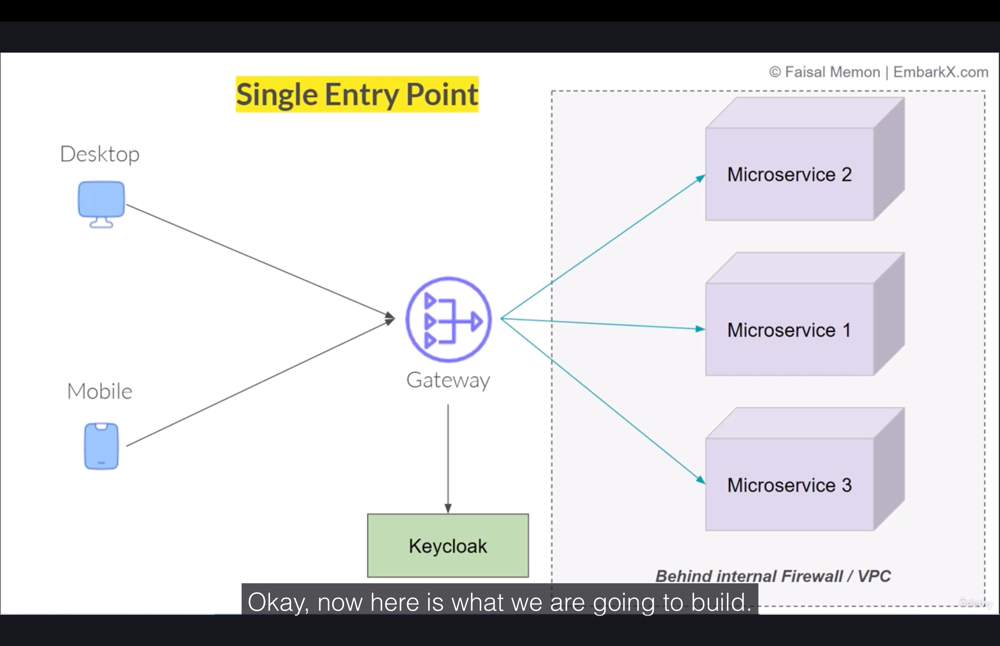

userid and pass shared across clients,
authentication and authorization
social logins - oauth and openid grant scopes 
login using company id or social both, store both details 
    ->   company{} and google_details{} in single db

IAM system - login, logout, password reset
manage user roles(admin, viewer), control over what user can access like apps
support social logins like google/facebook

Auth0 is generally better for customer-facing applications due to its developer-first focus, extensibility, and customization, 
  while Okta is typically used for workforce identity with its enterprise-grade security, out-of-the-box features, and scalability for internal users
    okta bought auth0

Usecases-
Enable SSO so that all internal users can access multiple applications using their Servicenow/Google Workspace credentials without needing to log in separately to each app.

Enable third-party developers to securely access our APIs without accessing internal systems (both through M2M and via external users).
Require MFA for internal users (I think I can enforce this in Google Workspace, but using okta is better)
Provision or add new users to the system as they enter or leave the org
Unified way of assigning permissions/roles to users

Keycloak - open source identity management system, okta has free and paid tier

IAM systems enable us to integrate social logins easily with our app-
SCIM provisioning, Saml/oidc+oppenid connect, SP initiated vs Idp initiated
mfa
authorization vs client credentials vs pkce flow
Okta used because better for enterprise, for High availability, disaster management etc.

Imp-
with this project, will learn how to do sso in backend, spring/node+okta backend
sso in store service to talk to different apps/services, implemented sso in store

React only acts as a display,  okta+snow/java/node sso
React display-> Spring boot communicates -> keycloak/okta

Store team+okta team
implemented sso in ecommerce microservices
I was in okta team earlier 1.5 yrs internal users, then moved to store team and implemented SSO there for external customers
unified Store Service, TPP Service and One Another Portal 
    //followups like load balancer can also add, horizontal scaled login service 
         //and add gateway/lb service before(circuit breaking, retry, rate limiting - gateway level) 
         //and service registry    
    //earlier users were in AD/Relational DB, later also there but for SSO we sync jobs for user federation and all
    //single logout
    //social login and link accounts
    //fine grained access control with mfa, admin console
    //update profile, password reset
    //added monitoring and alerts(service down)(prometheus) and logging(loki)(user dropoffs in grafana alerts) connected to grafana dashboard(add datasource connector),
         //lots of logs thus jobs rolling policy to purge data as well time and size
         //and distributed tracing zipkin, and resilience - circuit breaking, retry, rate limiting(service level)
30 minutes to talk about 

PKCE- is spa/native, then cant store credentials, thus exchange PKCE code, can generate on frontend only
and can exchange for access. 
Client credentials can store on backend fixed secret, in PKCE frontend generate credentials 
everytime and exchange for access

-----------------------------

Keycloak is not replacement for spring security, but keycloak works with spring security
keycloak oob helps us to do password hashing, csrf protection, session management, token generation,
logout, expiration, refresh token

Getting started - 
Start Keycloak
From a terminal, open the keycloak-26.4.5 directory.
Enter the following command:
>bin/kc.sh start-dev
Using the start-dev option, you are starting Keycloak in development mode. In this mode, you can try out Keycloak for the first time to get it up and running quickly. This mode offers convenient defaults for developers, such as for developing a new Keycloak theme.

Create an admin user
Keycloak has no default admin user. You need to create an admin user before you can start Keycloak.
Open http://localhost:8080/.
Fill in the form with your preferred username and password.

Log in to the Admin Console
Go to the Keycloak Admin Console.
Log in with the username and password you created earlier.

Create a realm
A realm in Keycloak is equivalent to a tenant. Each realm allows an administrator to create isolated groups of applications and users. 
Initially, Keycloak includes a single realm, called master. Use this realm only for managing Keycloak and not for managing any applications.

-or Directly use docker
>docker run -d -p 8443:8080 -e KC_BOOTSTRAP_ADMIN_USERNAME=admin -e KC_BOOTSTRAP_ADMIN_PASSWORD=admin quay.io/keycloak/keycloak:26.4.5 start-dev

---

in okta, we didnt make user roles, we had groups and added users to them

usr - admin_new
pass - admin

-a login screen
-a dashboard to manage users(emp, customer, admin) and apps
-roles/groups with permissions
- tenant/realm
-client - web/apis to connect your app with keycloak
- identity providers(other - like internal okta, google, github)
- protocols OIDC and Smal
- client - the application, eg store, tpp
- sessions and events
- usr registration, forgot password
- localization
- session setting timeout, idle etc
- client policies
- can create own social logins, but already preconfigured rest of them we get,
   dont need to do on our own unless custom

-----------

oidc - on top of oauth2, lightweight, fast, easy to connect
uses jwt tokens

oauth2.0 - we dont want to share our credentials/password to apps
 //and we cant have fine grained control, like google oauth, only access names claim/scope, 
 //with password, could access everything

open authorization - standard protocol, allows users to grant 3rd party
apps access to their information without sharing password, 
apps ask for scopes/claims along with sending oauth token to google authorization/resource server
authorization server on initial redirect sends authorization token(temporary and safe), which apps again sends to get access token
use access token and send to resource server(exchanged server to server, not visible in browser)
also refresh token

basically, app sends to google with redirecturl, we login, and google sends back to app with token
app configured with google oauth server endpoints

app uses token to talk to google, token has claims inside it

authorization server - for authentication and authorization by app and resource server, send and refresh token
to app
resource server - holds data, gets token, talk to authorization server if token valid 
with claims, and if valid, then send data back to app

IMP-
basically, i am building the 3rd party app(client), thus need backend and db to store tokens etc.,
  and logic to talk to authorization and resource server
also the login sso service, how these work with different apps services need to understand total how many services there?
- register the 3rd party app as client in authorization server/okta/keycloak
- there is a separate login service which stores token, and there is okta service, and there is 3 downstream services, which just ask user info
  from our login service which in turn calls okta resource server service with access token
  (so that each downstream service dont need to handle their own auth, also sso as access token still valid in login service)

   

(pkce is for apps that cant store tokens as dont have backend, in frontend only store token browser and create everytime)

Oauth2.0 is not a single flow. It has different flows for different cases-
-auth code flow(web app) (ropc, client has usr/pass of usr and exchange for auth token)
(here also app has client id and client secret)
-auth code flow with pkce(for only frontend app)  
-client credentials flow(basic auth like but with scopes) 

----------------

client-id: oauth2-authorization-code-flow
client-secret: 3EihdFXYrEy2Grc2V8Znc7rMUsLUxvks
scope: openid/profile,roles,email
authorization-grant-type: authorization_code #what flow we are using
issuer-uri: #used by spring to autofetch keycloak endpoints like login url, token url
redirect-uri: http://localhost:8080/login/oauth2/code/oauth2-authorization-code-flow
#where keycloak should send users after login

- there is a separate login service which stores token, and there is okta service, and there is 3 downstream services, which just ask login/user info
  from our login service which in turn calls okta resource server service with access token
  (so that each downstream service dont need to handle their own auth, also sso as access token still valid in login service)
- we dont need to create login page, as soon as someone send get request to login service we redirect directly to okta login page

downstream service get /login -> loginservice / ->oauth server login -> login service redirect with authcode -> downstream service redirect with user info

IMP-
we get 302 redirect from server for keycloack login  and  to redirect url with authcode as queryparams
     ,spring then gets claims and pass and the final get / url which intially called with user details object
thus, no frontend needed

in DefaultAuthorizationCodeTokenResponseClient class, debug
getTokenResponse() method so see the class object variable request / response object values in real time 

----------------------

Client Credentials flow(we wont be using this as wont get user info with this)

task management service(app2)(resource service) -> reporting service (app1)
//auth using client credential, auth server in between
//app1 sends request with its authcode, app2(resource service) verifies it

backend jobs, cron tasks, microservices communication
no end user interaction required

add spring oauth2 resource server dependency to app2 to make its endpoints authenticated
add spring oauth2 client dependency to app1 so that it talks to keycloak 
        via client credential to get token to send to app2 in api

security:
oauth2:
resourceserver:
jwt:
issuer-uri: http://localhost:8443/realms/oauth2-demos #used by spring to autofetch keycloak endpoints like login url, token url
#as resource server needs to validate jwt token

using spring security with oauth2

--------

OAuth2AuthorizedClientManager in app1 to execute a runner and make an api call
 (by default first fetches token and passes it)

    //app2 resource server

    @Configuration
    public class SecurityConfig {

	@Bean
	public SecurityFilterChain filterChain(HttpSecurity http) throws Exception {
		http
				.authorizeHttpRequests(a -> a
					.anyRequest()
					.authenticated())
				.oauth2ResourceServer(oauth2 -> oauth2
						.jwt(Customizer.withDefaults()));

		return http.build();
	}

}

    //app1 client use RestTemplate to make api call with Manager to service2url

	@Bean
	public CommandLineRunner run(   //runs as soon as service strats like a job
			OAuth2AuthorizedClientManager manager,
			RestTemplate rest,
			@Value("${service2.url}") String service2Url
	){
		//use RestTemplate to make api call with Manager to service2url

		return args -> {
			var authRequest = OAuth2AuthorizeRequest.withClientRegistrationId("keycloak-client")
					.principal("machine")
					.build();

			var client = manager.authorize(authRequest); //gives token

			String token = client.getAccessToken().getTokenValue();

			HttpHeaders headers = new HttpHeaders();
			headers.setBearerAuth(token);

			var resp = rest.exchange(service2Url + "/data",
					HttpMethod.GET,
					new HttpEntity<>(headers),
					String.class
			);

			System.out.println("Response from Service 2: " + resp);
		};

	}

    //can schedule the above job to run every hour

---------------

my project, login-service-client as oauth2-client(login service) calling resource server
            the client exposes api endpoints like /getresource which the 
            3rd party downstream services can call 

  //but we can allow calls from only internal network then why need internal auth? 

IMP-webservice client will expose endpoint(auth-code endpoint), and that endpoint will itself be authenticated
       and the webservice client will itself talk to resource server on the resource server's auth endpoint using client credentials

user-> generate report service(client web service)(auth-code) -> fetch user data(resource server)(client-credentials)

 //currently we are doing user -> client credential -> client credential
 //but best is user -> auth server -> client credential

----

IMP-
Postman itself has a way to generate client-credential token and send with request
if we configure authorization type as OAuth2.0

thus use that for user->client credentual->client credential flow

IMP-
authorization code also there where we send username and password via backend only

either use oauth2.0 auth type in postman(which send pre_api calls and add token to api call), 
 or directly get the token from a api call before

-------

we get both Id_token and access_token when do post call with client_credentials in postman

Q)id token vs access token oauth2.0
ChatGPT said:
Here's the cleanest possible explanation of ID Token vs Access Token in OAuth 2.0 + OpenID Connect, exactly how interviewers expect.
🔑 ID Token vs Access Token (OAuth 2.0 / OIDC)
🎫 ID Token

Purpose:
👉 Identify WHO the user is (authentication)
Issued by:
The OpenID Provider (OP) — for example, Google, Auth0, Azure AD.

Format:
Always a JWT.

Contains:
User identity (sub, email, name, etc.)
Auth time
Issuer
Expiry
Signature
Used by:
➡️ Your application to know which user is logged in.
Cannot be used to call APIs.

🔐 Access Token
Purpose:
👉 Authorize WHAT the user can access (authorization)

Issued by:
Authorization Server (can be same as OP)

Format:
Often JWT
But may be opaque (string)

Contains (if JWT):
Scopes
Roles / permissions
Audience (which API it is for)
Expiry

Used by:
➡️ APIs / Resource servers to allow/deny access.
Never meant to identify the user.

| Feature           | **ID Token**       | **Access Token**      |
| ----------------- | ------------------ | --------------------- |
| Purpose           | Authentication     | Authorization         |
| Who consumes it?  | Client Application | API (Resource Server) |
| Can it call APIs? | ❌ No               | ✅ Yes                 |
| Format            | Always JWT         | JWT or Opaque         |
| Describes         | The user           | Permissions/scopes    |
| Standard          | OpenID Connect     | OAuth 2.0             |
| Protected By      | Signature          | Signature + Scopes    |

When are both used?
Login with Google Example:
User clicks "Login with Google".
App receives:
ID Token → "User is john@gmail.com
Access Token → "User can read Google Drive files"

Your backend uses:
ID Token to create the session
Access Token (optional) to call the external API

---------

thus jwt has scope and user data, algo private key signed secret.
when we send again to verify, uses public key to check if signature correct or not, 
since laptop/browser has public key, dont need to make api call again to cert auth/auth server

thus our normal client acts like a proxy service to resource service

--------------------------

PKCE - proof key for code exchange
frontend only, dont want users to inspect token

extension to oauth2.0, make auth-code flow more secure

steps
1.client generates random string called code verifier, 
 then creates a challenge by hashing the code verifier using sha256 algorithm

2.code verifier is stored securely, and only challenge is sent to server
(then checks if hash match or not when gets  back)

3.client sends auth request with challenge to auth server

4.auth server login page, user enters details, redirect with auth code to 
client(if webapp then server redirect url)

5.client now sends auth token and  verifier(not challenge) to token endpoint
(code verifier acts as proof that client that initially requested auth code
is the same one which is actually sending the code)

IMP-
token server check if the sha256(verifier) passed is same as challenge(which is stored in 
auth token jwt)

-thus with PKCE, we know that client that requested, is same client which accessing

IMP-
in auth code flow also client id and client secret, but not the case here , just pkce code verifier and challenge

flow(normal auth flow)-
client-> "/" endpoint -> spring security intercept, sends to auth endpoint with client id, secret and scopes
 -> auth server gets username and apps -> redirect to redirect_uri sent, set in app.yml -> spring security listens there and 
converts auth id_token and access_token into an object, and --> sends object to "/" endpoint

IMP-
without frontend, we can use ropc flow, auth-code only,
just our frontend, and sends usr and pass to backend, and in backend only do
api call with clientid,clientsecret / pkce, usr, pass to get id and auth token

in backend proj, need to enable ropc else cant do auth flow with just backend,
need client credentials

IMP-
in postman, auth flow, with or without pkce uses browser, 
gets id, access and refresh token 
//postman listens to a port and makes redirect there, and once we get the token
//displays on app

this is the way, vscode logins using github,
open browser, and sends a get request to auth url 
with vscode client id, client secret/pkce and scopes to github auth server,
 -we enter username and password
and redirect url to an endpoint that opens vscode desktop app which has
id, access and refresh token to get user info and other info

claim is just keys of decoded auth/id/access/resource token jwt json

@RestController
public class HomeController {

	@GetMapping("/api/home")
	public String home(@AuthenticationPrincipal Jwt jwt){
					//@ injects jwt info
				//OAuth2AuthenticationToken token ){
		  //Imp - not using above as we are not client, but resource server here
		  //Postman is client
//		String email = token.getPrincipal().getAttribute("email");
//		String name = token.getPrincipal().getAttribute("name");
//		String roles = token.getAuthorities().toString();
String username = jwt.getClaim("preferred_username");

		return "Welcome, " + username;//name + ", " + email + ", " + roles;
	}

}

-----------------

Refresh token
expires_in 300
refresh_expires_in 1800

//refresh only for auth+code/pkce, not for client+-ropc

gets id(authenticate by backend user able), access(authorize info from resource server) 
  and refresh token- send to get new auth token w/o usr logging in

------

pkce with react -
>npm create vite@latest
>npm install react-oauth2-code-pkce

authConfig.js tells the react-oauth2-code-pkce library the config to use

offline_access - scope helps us use refresh tokens

AuthContext helps us know if user logged in, which user etc
allow cors, call api from backend using the token

---------

-----------------------------------------------------------------

Securing microservices with keycloak

1)client -> api gateway(auth code +pkce) -> keycloak -> redirect to client with token
2)client(with token)-> api gateway(gateway validates auth_code token, no microservice acts as resource server which validates)
    -> microservices(behind firewall/VPC) (client_cred if needed)
       (talk to each other using kafka like notif service)
       (talk to each other using reactive rest with client_credential oauth so that other internal services secured)

//pkce can be used for backend and frontend both thus good

added api for user creation, roles addition to user management service using keycloack endpoints

401/403 throws

thus I implemented pkce only on store homepage

IMP- dont need client_credential, only auth_code with api gateway
as microservices deployed in internal firewall/vpc eg kubernetes/docker/cloud
thus can add the vpc security rule to the subnet

thus only api gateway will have access to these microservices, thus dont need to secure individual microservices

---------

-can backup all realm setting using a json

IMP-
gateway acts as oauth2 resource server which verifies token
how to get pkce token, that is client's/ postman's/ app's  problem

---
cors vs csrf
Feature 	CORS (Cross-Origin Resource Sharing)	                              CSRF (Cross-Site Request Forgery)

Purpose	     To enable legitimate cross-origin requests                                  To prevent malicious websites from making unauthorized state-changing requests on behalf of an authenticated user.
              and control which external sites can read a response.	

Mechanism	The server uses specific HTTP headers (Access-Control-Allow-Origin, etc.)       Typically involves server-side validation using anti-CSRF tokens in requests or verifying
            to inform the browser whether a cross-origin request is permitted.	           the Origin header to ensure the request is intentional and from the legitimate application.

Enforcement	     Primarily a browser-side security mechanism; the browser blocks JavaScript   	A server-side protection mechanism; the server validates tokens or headers to determine if the request should be processed.
                 from accessing the response if the policy is violated.

Vulnerability	Poorly configured CORS (e.g., using a wildcard * with credentials)              The vulnerability exists when a server trusts an authenticated user's session cookie implicitly for state-changing operations without verifying the request's origin or intent.
                   can create security vulnerabilities.
---

IMP-
1)pkce+gateway service as resource server
2)rbac controls in gateway service api
3)user and role management api in gateway/service using keycloak service 

user dont use @Id, we need to use keycloak id,to pick from id/access_token now
user in model acts as extension for domain data for user present in keycloak

"sub" in jwt access token corresponds to keycloak user_id
"sub": "9e7658d6-5a81-4f71-bb52-3490c9113d2f",

have already done code of extracting userid, add filter to extract from jwt in gateway etc.

---

rbac, jwt token has roles, can use those

"resource_access": {
"account": {
"roles": [
"manage-account",
"manage-account-links",
"view-profile"
]
}
},

/*
Authentication auth = SecurityContextHolder.getContext()
.getAuthentication();

		String incomingToken = null;

		if(auth instanceof JwtAuthenticationToken jwtAuthenticationToken){
			incomingToken = jwtAuthenticationToken.getToken().getTokenValue();
		}
*/

	//converter to extract roles from jwt, and based on that jwt
	private Converter<Jwt, Mono<AbstractAuthenticationToken>> grantedAuthoritiesExtractor(){
/*
Your method returns a ReactiveJwtAuthenticationConverter, which implements:
Converter<Jwt, Mono<AbstractAuthenticationToken>>
*/

	@Bean
	public SecurityWebFilterChain filterChain(ServerHttpSecurity http) throws Exception {
//		http
//				.authorizeHttpRequests(auth -> auth
//					//.anyRequest()
//						.requestMatchers(("/api/**"))
//					.authenticated())
//				.oauth2ResourceServer(oauth2 -> oauth2
//						.jwt(Customizer.withDefaults()));
//
//		http.cors(cors -> cors.configurationSource(corsConfigurationSource()));
//		return http.build();

		return http.csrf(ServerHttpSecurity.CsrfSpec::disable)
				.authorizeExchange(exchange -> exchange
								.pathMatchers("/api/products/**").hasRole("PRODUCT")
								.pathMatchers("/api/users/**").hasRole("USER")
								.pathMatchers("/api/orders/**").hasRole("ORDER")
								.pathMatchers("/api/cart/**").hasRole("ORDER")
								.anyExchange().authenticated())
				.oauth2ResourceServer(oauth2 -> oauth2
						//.jwt(Customizer.withDefaults()))
						.jwt(jwt -> jwt.jwtAuthenticationConverter(grantedAuthoritiesExtractor())))
				.build();

	}

		ReactiveJwtAuthenticationConverter jwtAuthenticationConverter =
				new ReactiveJwtAuthenticationConverter();

		jwtAuthenticationConverter.setJwtGrantedAuthoritiesConverter(jwt -> {
			List<String> roles = jwt.getClaimAsMap("resource_access")
					.entrySet().stream()
					.filter(entry ->
							entry.getKey().equals("oauth2-pkce"))
					.flatMap(entry ->
							((Map<String, List<String>>) entry.getValue())
							.get("roles")
							.stream())
					.toList();

			System.out.println("Extracted Roles: " + roles);

			return Flux.fromIterable(roles)
					.map(role -> new SimpleGrantedAuthority("ROLE_" + role));

			//convert String to SimpleGrantedAuthority which represents role type in spring security
		});

		return jwtAuthenticationConverter;

	}

Http Request
↓
Bearer Token
↓
Decoded into Jwt
↓
grantedAuthoritiesExtractor().convert(jwt)
↓
Flux<SimpleGrantedAuthority>
↓
Mono<AbstractAuthenticationToken>
↓
SecurityContext
↓
Controller receives Authentication

"resource_access": {
"oauth2-pkce": {
"roles": [
"ORDER",
"PRODUCT",
"USER"
]
},

IMP-
we dont need realm level roles, but resource/app/client level roles for user 
on client/app - oauth2-pkce, create those roles
on user, assign the user those roles for the client

-----

now we got roles, now add restrictions rbac based on roles
(role for particular api calls to downstream service)

Extracted Roles: [PRODUCT]
Extracted Roles: [ORDER, PRODUCT, USER]

if product_user access user, then 403 forbidden error //not rbac authorized

-----

Keycloak Admin REST API, use in login-admin-service

in postman we have those endpoint collection

IMP-
in pkce, if we give user and pass in request in api along with client id and grant type = password(ropc),
then wont be redirected to frontend page and directly get the token
postman also has inbuilt oauth2.0 grant_type=password config

create user->
1)client_id is admin_cli, as need admin app token, keycloak acts as auth server
2)the token passed again to keycloak only as now keycloak itself acts as resource server
3)need to give the loggedin user role to create users (client = realm, roles= manage_users and view_users)

implement this api in ecommerce user service, to create the user in db and also in keycloak via api

IMP-
Thus-
1.we learn how to use keycloak admin api to create users(first get token)
2.how to use that api in our user service to create the user(first get token) in keycloak, get the user's keycloak_id, 
        and also create the user in db with that keycloak_id
  //and also while fetching users , directly we get keycloak_id saved in db user record

Assign roles to users-
get realm role by name
assign realm role to user
get client role by name
assign client role to user

use these apis to assign roles to user in user service
//these will be client level roles

Complete user creation flow-
1)create user gateway auth endpoint from pkce token
2)user service(has admin token) creates user , gets keycloak id
3)assigns role to the user
4)saves user to db with the keycloak_id

>docker run -d -p 8444:8080 -e KC_BOOTSTRAP_ADMIN_USERNAME=admin -e KC_BOOTSTRAP_ADMIN_PASSWORD=admin quay.io/keycloak/keycloak:26.4.5 start-dev

run a new instance in another port, 
-create realm and choose the file, or
-and go to realm setting and do partial import from that file

sys_id, client_uid doesnt change

--------

----------------------------------------------------------------------------------------

hld of my project-

IMP-
basically, i am building the 3rd party app(client), thus need backend and db to store tokens etc.,
and logic to talk to authorization and resource server
also the login sso service, how these work with different apps services need to understand total how many services there?
- register the 3rd party app as client in authorization server/okta/keycloak
- there is a separate login service which stores token, and there is okta service, and there is 3 downstream services, which just ask user info
  from our login service which in turn calls okta resource server service with access token
  (so that each downstream service dont need to handle their own auth, also sso as access token still valid in login service)
- we dont need to create login page, as soon as someone send get request to login service we redirect directly to okta login page

IMP-
we get 302 redirect from server for keycloack login  and  to redirect url, and the final get / redirect url has auth code as query params
thus, no frontend needed

thus SSO(via authorization flow)(tpp and store) + made all internal microservices authenticated(via client credentials flow) with protected apis + api gateway

my project, login-service-client as oauth2-client(login service) calling resource server
the client exposes api endpoints like /getresource which the
3rd party downstream services can call

//Q)but we can allow calls from only internal network then why need internal auth?

IMP-webservice client will expose endpoint(auth-code endpoint), and that endpoint will itself be authenticated
and the webservice client will itself talk to resource server on the resource server's auth endpoint using client credentials
user-> generate report service(client web service)(auth-code) -> fetch user data(resource server)(client-credentials)

IMP-
in auth code flow also client id and client secret, but not the case here , just pkce code verifier and challenge

flow(normal auth flow)-
client-> "/" endpoint -> spring security intercept, sends to auth endpoint with client id, secret and scopes
-> auth server gets username and apps -> redirect to redirect_uri sent, set in app.yml -> spring security listens there and
converts auth id_token and access_token into an object, and --> sends object to "/" endpoint

IMP-
without frontend, we can use ropc flow, auth-code only,
just our frontend, and sends usr and pass to backend, and in backend only do
api call with clientid,clientsecret / pkce, usr, pass to get id and auth token

in backend proj, need to enable ropc else cant do auth flow with just backend,
need client credentials

IMP-
also created api in my login service to create users, assign users etc using keycloak api
login service is embedded into my api-gateway service

upgraded microservices to talk to each other using reactive rest with client_credential oauth so that other internal services secured

added api for user creation, roles addition to user management service using keycloack endpoints
thus also created a user management service

thus I implemented pkce only on store homepage

IMP-
in pkce, if we give user and pass in request in api along with client id and grant type = password(ropc),
then wont be redirected to frontend page and directly get the token
postman also has inbuilt oauth2.0 grant_type=password config

IMP- dont need client_credential, only auth_code with api gateway
as microservices deployed in internal firewall/vpc eg kubernetes/docker/cloud
thus can add the vpc security rule to the subnet

thus only api gateway will have access to these microservices, thus dont need to secure individual microservices

IMP-
1)pkce+gateway service as resource server
2)rbac controls in gateway service api
3)user and role management api in gateway/service using keycloak service
    now we got roles, now add restrictions rbac based on roles
    (role for particular api calls to downstream service)

Complete user creation flow-
1)create user gateway auth endpoint from pkce token
2)user service(has admin token) creates user , gets keycloak id
3)assigns role to the user
4)saves user to db with the keycloak_id

Backup - export option in keycloak setting partial/full
saves a json file, like xml file. user not exported. rest roles, clients everything exported

-------------------------------------------------------------------------------------------

For service discovery in Node.js, similar to what Eureka does for Spring, you can use tools like Consul or etcd, which are popular service registries that provide a central 
place for services to register themselves and discover other services. You can also use DNS-based discovery within a container orchestration platform like Kubernetes.

Using a service registry

HashiCorp Consul: A widely used tool that provides service discovery along with other features like a key-value store and network security.
//just configure axios rest client to talk to hashicorp, and pass url as service-name

etcd: A distributed key-value store that is often used for service discovery in microservice architectures.

Apache ZooKeeper: A high-performance coordination service for distributed applications, also capable of handling service discovery.

Using Kubernetes
If you are deploying your Node.js services in a Kubernetes cluster, you can leverage its built-in DNS-based service discovery.
In this model, Kubernetes automatically creates a DNS record for each service, allowing other services to find them by their name

--------------------------------------------------------------------------------------------

Q)application/x-www-form-urlencoded vs application/json

Here’s a clear and practical explanation of the difference between
application/x-www-form-urlencoded vs application/json in REST calls — when to use which, how they behave, why OAuth prefers one, etc.

✅ 1. application/x-www-form-urlencoded
📌 What it is:
Key-value pairs encoded like URL query params.
Same format browsers use when submitting <form> without files.
Example Body
grant_type=client_credentials&client_id=abc&client_secret=xyz

How server receives it in backend:
As form parameters
Easily parsed into Map<String, String>

When it's used
✔ OAuth2 token endpoint (/oauth/token)
✔ Login forms
✔ Simple key-value requests
✔ HTML forms
✔ Legacy APIs

Why OAuth uses this?
📌 Because the OAuth spec requires token endpoints to support this format.
⚠ Behavior Characteristics
No nested structure
No arrays
No JSON objects
Only string-based parameters

🟩 Pros
Very small payload
Works everywhere (browsers, old servers)
Required in OAuth2 token requests

🟥 Cons
Not meant for complex data
No nested JSON structure
Harder to send arrays or objects

✅ 2. application/json
📌 What it is:
JSON body sent in the request
Most modern REST APIs use this

Example Body
{
"username": "john",
"roles": ["admin", "user"],
"settings": {
"theme": "dark"
}
}

How server receives it:
Deserialized into objects
Supports nested JSON, arrays, objects, booleans, numbers
🟩 Pros
Hierarchical rich data
Supports complex request bodies
Modern API standard
Works perfectly with microservices + frontend apps

🟥 Cons
Slightly larger
Browsers can't send it automatically via basic <form>
🔥 3. When to Use Which? (Simple Table)

Use Case	Recommended Content-Type
OAuth2 /token request	application/x-www-form-urlencoded
Login via form submit	application/x-www-form-urlencoded
Sending structured REST data	application/json
Mobile/Frontend → Backend POST	application/json
Microservices communication	application/json
Simple key=value	x-www-form-urlencoded

⚡ Why OAuth Token Endpoint Doesn’t Accept JSON?
According to RFC 6749 (OAuth2 spec):
Content-Type: application/x-www-form-urlencoded
Token requests MUST use this format.
This is why when you send JSON to a token endpoint:
{"grant_type": "client_credentials"}
→ You get:
❌ unsupported_grant_type
❌ invalid_request

🔍 Practical example in Spring Boot
For application/x-www-form-urlencoded:
@PostMapping(value = "/token", consumes = MediaType.APPLICATION_FORM_URLENCODED_VALUE)
public TokenResponse getToken(@RequestParam Map<String, String> form) { ... }

For application/json:
@PostMapping(value = "/createUser", consumes = MediaType.APPLICATION_JSON_VALUE)
public User createUser(@RequestBody User user) { ... }

--------------------------------------------------------------------------------------------

