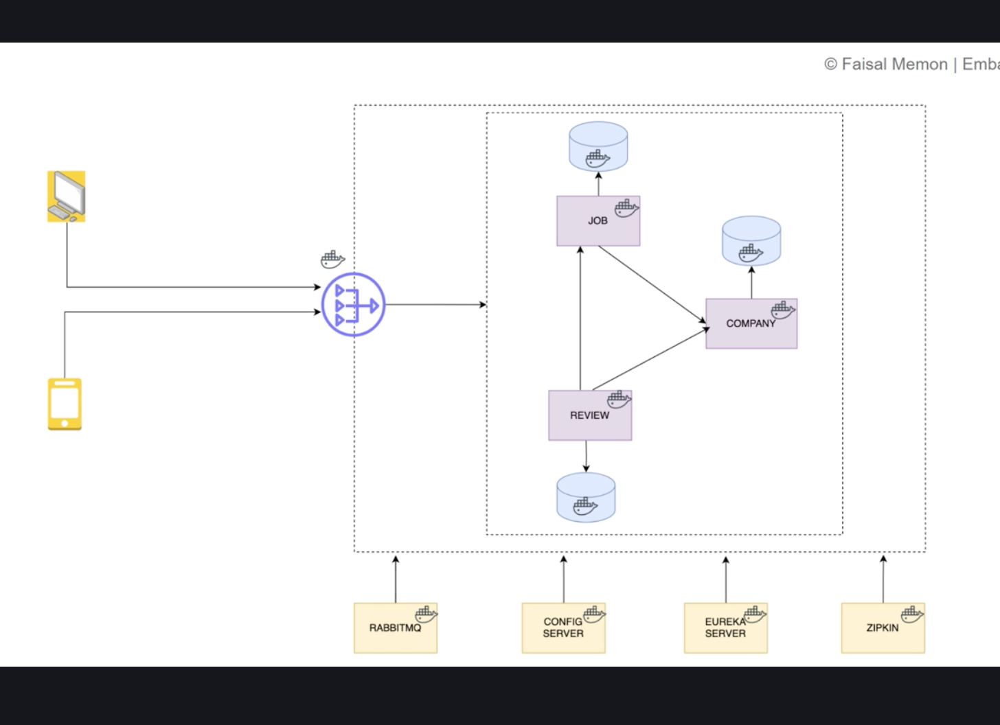
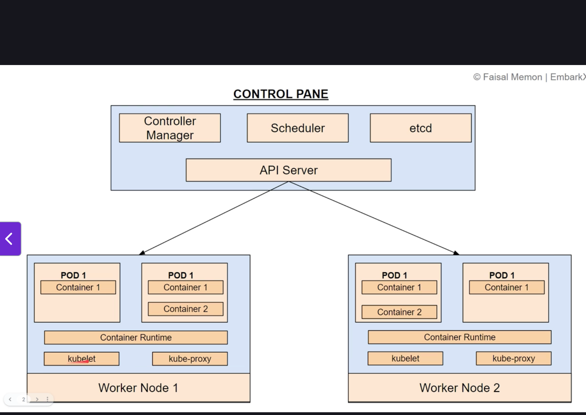

deploy

----

docker 3 ways
-dockerfile
-buildpacks spring //creates images based on pom.xml
                   //layers and image caching 
-jib
 // a maven/gradle plugin that builds docker images without docker installed,
 // directly from build tool

-docker system prune -a --volumes --force
-docker network prune --force
-docker rm -f $(docker ps -q)

1.dockerfile
get jar
> ./mvnw clean package -DskipTests
> create docker file with
> FROM eclipse-temurin:23-jdk-ubi9-minimal
> WORKDIR /app
> COPY target/*.jar app.jar
> EXPOSE 8082
> ENTRYPOINT ["java", "-jar", "app.jar"]

>docker build -t config-server ./configserver
>docker run --env-file configserver/.env -d --name config-server -p 8889:8888 config-server

after each change, rebuild jar and each step

>chmod +x ./mvnw

-----

Config management in docker

services inside docker communicate using service-names,
just like eureka

IMP-
but we mapped port inside container to ext port, 
   then Others can communicate to it using ports of localhost etc.
localhost will refer to container itself, not others
   thus it ITSELF cant communicate to others using localhost name

thus use service names only, did the same in observability
AS SHARE SAME NETWORK IN DOCKER

earlier all services and eureka we were getting localhost ips 
now need to change to service-names

means, earlier in eureka,  service-name: localhost:port
                     now,  service-name: docker service-name
docker/kubernetes acts as eureka server itself

    cloud:
        config:
            server:
                native:
                    search-locations: classpath:/config
                    #file:///Users/abhinav.bhattacharje/springboot_proj/ecom_microservices/configserver/src/main/resources/config
                    #docker cant use above, move above to volume

      resourceserver:
        jwt:
          issuer-uri: http://keycloak:8080/realms/ecom-app
            #http://localhost:8443/realms/ecom-app #used by spring to autofetch keycloak endpoints like login url, token url
            #in keycloak container, running at 8080 port
            #cant use localhost inside docker, use service-name itslef

in config server, add files as gateway-service-docker.yml
and in the gateway-service application.yml, use profile
    
    spring:
        profiles:   
            active: docker

but dont explicitely state that, pass it from docker-compose
    environment:
      - SPRING_PROFILES_ACTIVE=docker

env vars in docker using environment: tag

1)create docker specific config for each service for docker container using service-name
2)pass env vars from docker-compose file
3)add env to docker-compose using main .env file

-docker exec config-server ls /config

    healthcheck:
      test: ["CMD", "wget", "--spider", "http://localhost:8761/actuator/health"]
      interval: 10s
      timeout: 5s
      retries: 5

   as without it, docker only checks whether container running or not, not whether app inside container is running or not

postgres-
    volumes:
      - postgres:/data/postgres
      - ./init-multi-db.sql:docker-entrypoint-initdb.d/init.sql

postgres on creation loads this special file and runs it which creation of db service

>docker compose down -v

-chmod +x build-projects.sh 
-./build-projects.sh 

---------------------------

buildpacks

>./mvnw spring-boot:build-image -DskipTests  /
         -Dspring-boot.build-image.imageName=<image-name>
> 
{start cmd and metadata, .jar, app dependencies, java runtime}

can run on any cloud

				<configuration>
					<image>
						<name>ecom/config-server</name>
					</image>
				</configuration>

<name>	The image name and optionally tag (e.g., my-app:1.0).
<builder>	The builder image used to build the app (default is Paketo's base).
<runImage>	Optional. Base image used during runtime.
<env>	Set environment variables used during build (e.g., JVM version, memory limits).
<publish>	If true, pushes the built image to a remote Docker registry.
<docker>	Credentials used if you're publishing the image to DockerHub or another registry.

#image built with docker-compose
config-server:
    build: ../../configserver       
    #image: ecom/config-server #image built with builtpacks
    container_name: config-server

-----

gateway security error  - iss claim is not valid in token 
as iss = http://localhost:8443/realms/ecom-app
but it is inside docker, thus to verify the token, we need to update code 
inside gateway

within gateway, we have configured
resourceserver:
    jwt:
        issuer-uri: http://keycloak:8080/realms/ecom-app

keycloak issue - 
1)Update Keycloak realm settings → Realm Settings → Endpoints → “Frontend URL”
http://keycloak:8080
//2)or do same for all realms via docker-compose env-
//KC_HTTP_ENABLED: "true"
//# INTERNAL Hostname (used by other containers)
//KC_HOSTNAME: "localhost"
//KC_HOSTNAME_URL: "http://localhost:8443"
//# ALLOW mismatch for internal docker URL "keycloak"
//KC_HOSTNAME_STRICT: "false"
//KC_HOSTNAME_STRICT_HTTPS: "false"

------------------------------------------------------

Observability with docker containers

backend network for backend related tasks
loki network for loki/minio(storage)/ related tasks

And then I went into the container and used kcadm.sh like this:
# cd /opt/keycloak/bin
# ./kcadm.sh config credentials --server http://localhost:8080 --realm master --user admin
# ./kcadm.sh update realms/master -s sslRequired=NONE
#./kcadm.sh update realms/ecom-app -s sslRequired=NONE

ps aux | grep otel

zipkin:
image: openzipkin/zipkin
container_name: zipkin
ports:
- 9411:9411
networks:
- loki
- backend

add zipkin to both networks

------------------------------------------------------

jib, w/o docker, on ci/cd servers can use to build image

add <plugin> to pom.xm with dockerhub/gcr url,credentials, name etc.

>./mvnw compile jib:build //push to hub
>./mvnw clean compile jib:build 
            //removes /target/*.jar, and compiles java code, then builds image
>./mvnw compile jib:dockerBuild //use cred in pom file, or just do docker login in cli, it takes stored cred
>./mvnw jib:buildTar //et a .tar file offline use and share, use with >docker load

google built it

-----------------------------------------------------------

Restricting Direct Access to service containers without Gateway-

containers now need vpc, inbound firewall rules to only grant access 
to ip of gateway
look at sso.png

in docker, easy,
    -just dont expose docker port outside
    remove    ports:
                - 8082:8082

IMP-
thus now, from external only accessible by gateway-service, and gateway-service
talk to other services inside docker environment different containers
docker is like a cloud env only

-----------------------------------------------------------

Microservice Packaging

now we have microservices in 
1)different server(localhost server:port in app.yml)
2)docker container -docker compose  services: 
3)have profiles different config with env. vars and gateway-service-prod/docker.yml

but how to move them b/w dev,staging,prod in another good way?

without packaging springboot application executes as follows-
-code compilation(.class file bytecode)
-run main class
-without jar, we need to set classpath correctly to use dependencies
(in jar, everything is packaged)
-embedded server
-source code changes(just run again, dont need to rebuild jar)
-can use development mode without jar, rapid integration and modification

packaging - 
compile into bytecode with dependent libraries in a single executable artifact-
easily run(jar-java archive)
jre executes jar

.war , ear, docker image are different packaging options

pom - project object model

--
download maven and get it installed from apache maven website
Or use maven wrapper ./mvnw , that we automatically get with springboot apps
    .mnv/wrapper/maven-wrapper.properties file

>mvn clean //remove all prev built files
           //.class and .jar files
>mvn package  //compiles and packages
> mvn install //install dependencies based on pom

>jar -tf target/configserver-0.0.1-SNAPSHOT.jar 
     //show all .jar and .class and other file inside it
>java -jar  target/configserver-0.0.1-SNAPSHOT.jar 

now we have single postgres instance, varius db inside it
but can have many service: posgres-product and postgres-order in docker compose
 config.yml -  url: jdbc:postgresql://postgres-product:5432/productdb

docker is like a cloud env only
./mvnw spring-boot:build-image "-Dspring-boot.build-image.imageName=<your-dockerhub-username>/<your-image-name>"
 
<build>
<plugins>
spring-boot-maven-plugin

this plugin helps us to use - spring-boot:build-image
--

IMP-

if services container shutdown, then
1)make sure postgres has that db created, or use init-multi-db.sql file
add restart: on-failure in docker-compose

test -
http://localhost:8082/jobs
http://localhost:8761/

-----------------

Kubernetes

scaling, x no. of services, autodeploy start and stop old pods,
how should they run and interact, in built gateway, discovery etc.

--

benefits-
-service discovery and load balancing-
    can run and get services via service names
    load balance traffic, autoscale
-automated rollouts and rollbacks
-autoscale up or down, with cli or ui
-self-healing(monitors health of nodes and containers, 
  does not replace the container that fail, but autorestart the container
  that doesnt respond to health checks, 
  and doesnt advertise them to clients untill they are ready to serve)
-secret and config management

--

arch - 
control pane and worker nodes

-----------------------------------------------------

Q)kubernetes control pane scheduler vs control plane vs etcd

ChatGPT said:

Here’s the clean, crisp breakdown you need — Control Plane vs Scheduler vs etcd in Kubernetes:

🚀 1. Kubernetes Control Plane (the whole brain)
The Control Plane = all the master components that manage the cluster.
It contains:
kube-apiserver → the front door; all communication goes through this
kube-scheduler → decides where pods run
kube-controller-manager → ensures cluster desired state (replicas, nodes, endpoints…)
cloud-controller-manager → cloud-specific logic
etcd → database that stores cluster state

Think of it like:
🧠 Control Plane = Entire brain of Kubernetes
Each component = different part of the brain.

🚀 2. kube-scheduler (part of the control plane)
The scheduler is a single component inside the control plane.
What it does:
Watches for Pending pods
Chooses the best node for each pod using:
resource availability (CPU / RAM)
taints & tolerations
node selectors
affinities
constraints
scoring algorithms

⛳ It only assigns a node.
It does not start containers. That’s done by kubelet on the worker node.
Analogy:
🧑‍🏫 Scheduler = Exam invigilator who decides which classroom each student goes to.

🚀 3. etcd (database of Kubernetes)
etcd = a distributed key-value store that keeps all cluster state:
nodes
pods
configmaps
secrets
deployments
events
networking metadata
If etcd dies → your cluster loses its state.

Analogy:
🗄️ etcd = Kubernetes' source of truth.
The apiserver reads/writes everything to it.

🧩 How they work together
1️⃣ You apply a Deployment
kubectl apply -f deploy.yaml
API server validates it
Writes the desired state to etcd

2️⃣ Controller Manager sees desired ≠ current
Creates ReplicaSets → pods
Stored in etcd
3️⃣ Scheduler sees new Pending pods
Picks best node
Updates API server → etcd
4️⃣ Kubelet on that node
Pulls image
Starts the pod
Reports status → API server → etcd

🎯 TL;DR (super short)
Component	Role
Control Plane	All master components that run the cluster
kube-scheduler	Part of control plane; assigns pods → nodes
etcd	Database storing all cluster state

-----------------------------------------------------

minikube helps us run kubernetes in local system
we just need docker daemon

>minikube start

minikube mimics real kubernetes cluster

Minikube is just a local, single-node Kubernetes cluster for developers.
But in production, Kubernetes is much larger, multi-node, distributed

Q)How do companies install production Kubernetes?
There are 4 common methods:
✅ 1. Managed Kubernetes (most common)
Cloud providers run the control plane for you.
Examples:
Amazon EKS (AWS)
Google GKE (GCP)
Azure AKS (Azure)
DigitalOcean Kubernetes
Linode LKE

Here:
Control plane is fully managed
You only manage worker nodes (or even those can be auto-managed)
📌 This is what 90% of companies use.

Enterprise Kubernetes Platforms
These companies provide Kubernetes as a packaged solution:
Red Hat OpenShift
VMware Tanzu
Rancher Kubernetes Engine (RKE)
Canonical Kubernetes

These give:
monitoring
networking
secret management
UI dashboards
enterprise support

| Feature           | Minikube   | Production K8s                   |
| ----------------- | ---------- | -------------------------------- |
| Nodes             | 1 node     | Many nodes                       |
| High Availability | ❌ No       | ✅ Yes                            |
| etcd              | Local file | Distributed cluster              |
| Load Balancers    | Simulated  | Real cloud LBs                   |
| Storage           | Local      | Network + cloud storage          |
| Networking        | Simplified | Full CNI (Calico, Cilium, Weave) |
| Traffic           | Local only | Global, load-balanced            |
| Scale             | A few pods | Thousands+                       |

----------------------------------------------------------

>brew install minikube
> minikube start --driver=docker   //or can use virtualbox virtualization

>minikube  //get info of all commands

minikube
minikube provisions and manages local Kubernetes clusters optimized for
development workflows.

Basic Commands:
start            Starts a local Kubernetes cluster
status           Gets the status of a local Kubernetes cluster
stop             Stops a running local Kubernetes cluster
delete           Deletes a local Kubernetes cluster
dashboard        Access the Kubernetes dashboard running within the minikube
cluster
pause            pause Kubernetes
unpause          unpause Kubernetes

Images Commands:
docker-env       Provides instructions to point your terminal's docker-cli to
the Docker Engine inside minikube. (Useful for building docker images directly
inside minikube)
podman-env       Configure environment to use minikube's Podman service
cache            Manage cache for images
image            Manage images

Configuration and Management Commands:
addons           Enable or disable a minikube addon
config           Modify persistent configuration values
profile          Get or list the current profiles (clusters)
update-context   Update kubeconfig in case of an IP or port change

Networking and Connectivity Commands:
service          Returns a URL to connect to a service
tunnel           Connect to LoadBalancer services

Advanced Commands:
mount            Mounts the specified directory into minikube
ssh              Log into the minikube environment (for debugging)
kubectl          Run a kubectl binary matching the cluster version
node             Add, remove, or list additional nodes
cp               Copy the specified file into minikube

Troubleshooting Commands:
ssh-key          Retrieve the ssh identity key path of the specified node
ssh-host         Retrieve the ssh host key of the specified node
ip               Retrieves the IP address of the specified node
logs             Returns logs to debug a local Kubernetes cluster
update-check     Print current and latest version number
version          Print the version of minikube
options          Show a list of global command-line options (applies to all
commands).

Other Commands:
completion       Generate command completion for a shell
license          Outputs the licenses of dependencies to a directory

-------------------

//kubectl is now configured to use "minikube" cluster and "default" namespace by default
>kubectl //a cli using which we can interact 
         //with apiserver/minikube/cloud control pane api server

> kubectl cluster-info
> Kubernetes control plane is running at https://127.0.0.1:54234
> CoreDNS is running at https://127.0.0.1:54234/api/v1/namespaces/kube-system/services/kube-dns:dns/proxy

in intellij can also add and watch kubernetes cluster in services section, plugin there automatic

-----------------------

can also use docker desktop to create kubernetes cluster-
Kubeadm
Create a single-node cluster with kubeadm.

kind
Create a cluster containing one or more nodes with kind. Requires the containerd image store

--

but we will just use minikube

>minikube dashboard

http://127.0.0.1:55313/api/v1/namespaces/kubernetes-dashboard/services/http:kubernetes-dashboard:/proxy/#/workloads?namespace=default

Kubernetes object - pod, service, replica set, deployment, stateful sets, cron jobs, config maps

---------------------------------

Pod

-A pod groups one or more containers and their shared resources, such as 
volumes(storage), IP address and network ports
-containers within a pod run on the same worker node and share the same lifecycle
-pods are ephemeral and can be created, scheduled and destroyed dynamically

-pod is not a durable entity(a new pod will replace it) 
-not designed for horizontal scaling on its own
  (achieve scaling by creating multiple identical loads and distributing workload amongst them)

-pod should be stateless in design, data/state store in 
    external volumes/config maps/managed abstractions like stateful sets 
-pods communicate with each other within the same cluster using localhost
  how(even in different nodes/pods)? - as etcd is like service registry, 
      also use interprocess communication mechanisms like shared memory 

-pods are assigned unique ip address within cluster
-lifecycle and availability, health of pods is managed by kubernetes

-pods can have associated labels, annotations which are helpful when we do 
 grouping, filtering, and selecting pods when we define deployments, services
 or other kubernetes resources

apiVersion: v1
kind: Pod
metadata:
name: my-pod
spec: #desired state of pod, and what apps/services it should run
containers:
- name: nginx
  image: nginx:1.14.2
  ports:
    - containerPort: 80

>kubectl apply -f first-pod.yml
>kubectl --kubeconfig 

To view the clusters defined in your kubeconfig file, you should use the kubectl config get-clusters command:
Code
>kubectl config get-clusters

I have 3 clusters now in local - 
docker-desktoop
minikube
rancher-desktop

IMP-
kubeconfig //file has all kubectl data like user/pass, azure/aws, clusters etc.

---

kubectl apply -f first-pod.yml
The Pod "my-pod" is invalid: spec.containers: 
Forbidden: pod updates may not add or remove containers

Pods are immutable, once created, cannot manually(scheduler can do)
add or remove containers from it.
thus need to destroy it and create again

>kubectl get pods

thus change pod name in .yml file

>kubectl get pod -w  //watch mode, live status updates

-------------

Service - a way to access the pods
a service in kubernetes is an abstraction that defines a 
logical set of Pods and a policy by which to access them(microservice)

since pods are ephemeral, cant rely on ips as change

thus, with the help of Service, can have persistant connections
to pods regardless of changes of those pods

apiVersion: v1
kind: Service
metadata:
name: my-service
spec:
selector:
app: MyApp
ports:
- protocol: TCP
port: 80
targetPort: 9376

---

selector will route the traffic across the set of pods
that match the selector label

targetPort: 9376 //port on pod where traffic is routed

>kubectl apply -f first-service.yml
>kubectl get service

Exposing application-
3 Types of service(type determines accesibility) -
  //here cluster is podcluster inside node, not kubecluster
(within node hosting pod,within kubecluster,outside kubecluster)

- ClusterIP //default,gives service its own ip address to communicate with 
            //other services within the cluster
- NodePort //exposes service on same port across each node 
           //externally outside cluster using nodeip and nodeport
- LoadBalancer //exposes externally using cloud provider's load balancer
               //assigns a fixed external ip to the service
               //used in cloud based env where lb can be provisioned automatically

type: LoadBalancer

----------------

Replica Sets-

Kubernetes obj - used for managing and scaling 
   a set of identical pod replicas

why need set of identical pods?
-availability(if one pod fails, other replicas can cont. to serve requests)
-load balancing
-scaling
-rolling updates(old ones gracefully terminated, identical)
-service discovery and lb
 (identical pods with a common label 
 can be easily discovered and load balanced by another k resource
 like services)

replica sets ensure certain number of identical pods are always up and running

-not for handling rolling updates/deployments
(only focuses on maintaining desired no. of replicas, even during deployment)
-does not provide declarative updates to the pods it manages
 (to update pods, we need to create a new replica set with updated configuration
  and delete the old one)
 
-replica sets use selector to identify pods it manages
  selector(just a label) defines criteria for matching pods
-specify number of replicas

-replica sets are often used together with deployments, deployments are
 the ones that manage rolling updates and deployements can define there

-when updating pod config, image version, resource req., use Deployments 
 instead of directly modifying replica set

apiVersion: apps/v1
kind: ReplicaSet
metadata:
name: my-replicaset
spec:
replicas: 3
selector:
matchLabels:
app: nginx
template:
metadata:
labels:
app: nginx
spec:
containers:
- name: nginx
image: nginx:1.14.2
ports:
- containerPort: 80

>kubectl apply -f replica-set.yml
>kubectl get pods -w
>kubectl get replicaset
>kubectl delete pod my-replicaset-78jlz //again new pod created in replica

my-replicaset-pwdqn   1/1     Terminating   0          8m52s
my-replicaset-rbqf8   0/1     Pending       0          0s
my-replicaset-rbqf8   0/1     ContainerCreating   0          0s
my-replicaset-pwdqn   0/1     Completed           0          8m52s
my-replicaset-rbqf8   1/1     Running             0          1s
my-replicaset-pwdqn   0/1     Completed           0          8m53s

-----------------

Deployments

need to only describe the state in deployment object
and deployment/kubernetes controller changes the actual state 
to desired state at a controlled rate

thus, can rollout/rollback to pre versions w/o interruption

deployment(superset)>replica set>service>pod

apiVersion: apps/v1
kind: Deployment
metadata:
name: my-deployment
spec:
replicas: 3
selector:
matchLabels:
app: myapp
template:
metadata:
labels:
app: myapp
spec:
containers:
- name: myapp
image: nginx:1.14.2

>kubectl get deployments
>kubectl describe deployment my-deployment
>kubectl logs my-deployment-749b4b879b-jd5kc

1.thus deployment most superset for all kube things
2.also only deployment file change and apply again, it recreates everything rolling

----------------------------------------------------------------------

Deploying Zipkin, RabbitMq, Postgres to Kubernetes

>kubectl apply -R -f ./k8s/services/
 //takes all files inside subfolders recursive and apply

deployment file - necessary for updated and running a specific 
number of pods in the cluster

service file - a service will be responsible for providing network
access to one or more pods based on selector: {labelkey}:{labelvalue}

      port: 9411
      targetPort: 9411
type: LoadBalancer //provisions external load balancer
        ///that routes traffic to selected endpoints       

port on service 9411 to targetPort 9411 of pod

Thus, run zipkin along with
NodePort Service → nodePort
ClusterIP Service → port
Pod → targetPort

-----

Postgres, we need persistant data
thus need config map(config kv store), 
  stateful set(manages deployment of a pod and guarantees uniqueness) 
  volume(storage), service 

service - used to provide stable endpoints to the application

>kubectl get all
>kubectl delete deployments --all --all-namespaces
>kubectl delete services --all --all-namespaces
  //1st delete deployments, and then also delete services routing to those pods
>kubectl delete pods --all --all-namespaces
//replicasets still exist
>kubectl delete replicasets --all --all-namespaces

>kubectl apply -f ./services/postgres/
>kubectl apply -R -f .k8s/services/

//setup db inside the pod
>kubectl exec -it postgres-0 -- psql -U embarkx
//postgres-0 name of pod the command is executed in

>minikube stop //and start

--
>\l   //grt list of dbs, 'q' for quit
>\list
> create database job;
> create database review;
> create database company;
>\q   //to exit

----

dont need api gateway and service discovery and config server

1) instead of api gateway, use kubernetes Ingress Controllers(lb, path/custom routing, ssl termination)
    to manage external access to services inside the cluster
Service Mesh can be used for more advanced traffic routing patterns, 
    fault tolerance and security

2) service discovery also managed internally in kubernetes

for docker and local setup, have it, but for kubernetes, can do
without it

3) dont need centralized config server, can use Config Maps or Secret Objects instead

>./mvnw spring-boot:build-image "-Dspring-boot.build-image.imageName=bhattacharjeeabhinav/companyms"
>docker push bhattacharjeeabhinav/companyms
 
it uses pom.xml to build image(image used in kubernetes yml file)

----------------------------------------------------------------------------------------------------------------

Enabling and Accessing Services using Minikube-

IMP- 
-we cant directly access services running in a minikube cluster

//can do via connect to ssh but not via host:port unless loadbalanced/nodeport
>kubectl exec -it postgres-0 -- psql -U embarkx

anyways, need minikube command-
>minikube service zipkin --url //get service url
http://127.0.0.1:56972
❗  Because you are using a Docker driver on darwin, the terminal needs to be open to run it.

IMP
//means service will be running,
  //but accessibility will be cancelled as not using loadbalanced/nodeport
//thus minikube using this command, in dev env allows us to access
  as maybe pods remains same etc makes change to kubecontroller/scheduler
  Thus, handy for development and check pod services which dont expose NodePort/LoadBalanced

------------------------------------------------

Testing application in k8s

>kubectl apply -R -f ./k8s/
>minikube dashboard                         //access the services ui
>minikube service zipkin --url              //access the services url
>kubectl exec -it postgres-0 -- psql -U embarkx   //access the services ssh
>kubectl get all

---
NAME                                 READY   STATUS              RESTARTS      AGE
pod/company-5f49896c5-qrpk8          0/1     ContainerCreating   0             20s
pod/job-5b876bddb6-9dpvz             0/1     ContainerCreating   0             20s
pod/my-deployment-749b4b879b-6vkft   1/1     Running             0             20s
pod/my-deployment-749b4b879b-9l6hj   1/1     Running             0             20s
pod/my-deployment-749b4b879b-b2pvc   1/1     Running             0             20s
pod/my-new-pod                       2/2     Running             0             20s
pod/my-replicaset-2f48m              1/1     Running             0             20s
pod/my-replicaset-qlr6n              1/1     Running             0             20s
pod/my-replicaset-vgqbq              1/1     Running             0             20s
pod/postgres-0                       1/1     Running             1 (34m ago)   4h3m
pod/rabbitmq-5bf9d948f5-58tfh        1/1     Running             0             18m
pod/review-795f7c78f9-bblmm          0/1     ContainerCreating   0             20s
pod/zipkin-6c97b8f56c-g6ftm          1/1     Running             0             18m

NAME                 TYPE           CLUSTER-IP       EXTERNAL-IP   PORT(S)          AGE
service/company      LoadBalancer   10.99.181.117    <pending>     80:31404/TCP     20s
service/job          ClusterIP      10.107.89.64     <none>        80/TCP           20s
service/kubernetes   ClusterIP      10.96.0.1        <none>        443/TCP          4h7m
service/my-service   ClusterIP      10.101.127.100   <none>        80/TCP           20s
service/postgres     ClusterIP      10.101.56.234    <none>        5432/TCP         4h3m
service/rabbitmq     NodePort       10.97.217.49     <none>        5672:30500/TCP   18m
service/review       ClusterIP      10.105.164.107   <none>        80/TCP           20s
service/zipkin       LoadBalancer   10.102.9.133     <pending>     9411:32596/TCP   18m

NAME                            READY   UP-TO-DATE   AVAILABLE   AGE
deployment.apps/company         0/1     1            0           20s
deployment.apps/job             0/1     1            0           20s
deployment.apps/my-deployment   3/3     3            3           20s
deployment.apps/rabbitmq        1/1     1            1           18m
deployment.apps/review          0/1     1            0           20s
deployment.apps/zipkin          1/1     1            1           18m

NAME                                       DESIRED   CURRENT   READY   AGE
replicaset.apps/company-5f49896c5          1         1         0       20s
replicaset.apps/job-5b876bddb6             1         1         0       20s
replicaset.apps/my-deployment-749b4b879b   3         3         3       20s
replicaset.apps/my-replicaset              3         3         3       20s
replicaset.apps/rabbitmq-5bf9d948f5        1         1         1       18m
replicaset.apps/review-795f7c78f9          1         1         0       20s
replicaset.apps/zipkin-6c97b8f56c          1         1         1       18m

NAME                        READY   AGE
statefulset.apps/postgres   1/1     4h3m

---

>minikube service job --url
minikube service job --url
😿  service default/job has no node port
❗  Services [default/job] have type "ClusterIP" not meant to be exposed, however for local development minikube allows you to access this !
http://127.0.0.1:59220
❗  Because you are using a Docker driver on darwin, the terminal needs to be open to run it.

//in zipkin didnt see this error as its type is LoadBalancer, thus open to external.
//still minikube needed as loadbalancer works only with cloud, gives fixed ext ip

IMP-
thus, to test app, from postman, hit job api calls with this host 
given by minikube -
http://127.0.0.1:59220

Thus Steps-
1)pom.xml, spring-boot:build-image and deploy to hub
2)create kube yml file, add that image name
3)run local kubernetes cluster with minikube
4)run the kube yml file using kubectl
5)create a db in postgresql pod,
if no init file mentioned while creating image(decode007 didnt have it)
>kubectl exec -it postgres-0 -- psql -U embarkx
> create database job; //review and company also

6)if only clusterip/loadbalanced (not nodeport), 
   then in dev run >minikube service <name> --url
  to get temp url

>minikube dashboard                         //access the services ui
>minikube service zipkin --url              //access the services url

7)add that host in postman api call and test 

>kubectl logs job-5b876bddb6-9dpvz
   //if error, manually delete and create the deployment and service as
   //kubernetes on its own uses exponential backoff strategy

the image that decode007 has is the docker compatible image, not k8s image,
thus we need to create our own and then use it in kube yml
but okay not breaking change

thus create  localimage and use that in kubeconfig
(it will use local/docker postgres, not kubernetes while building thus
make sure it is running)

see changes in db after api calls-
embarkx=# \c job
You are now connected to database "job" as user "embarkx".
job=# select * from job ;
ERROR:  relation "job" does not exist
LINE 1: select * from job
^
job=#

Connectivity Test: Try curling the endpoint from within the pod itself to confirm it works internally:
kubectl exec -it <pod-name> -- curl http://127.0.0.1:8081

---------------------------------------------------------------------------

Q)stateful set vs volumes postgresql

ChatGPT said:
Here is the clearest explanation of StatefulSet vs Volume vs PVC specifically for PostgreSQL in Kubernetes — with diagrams, mental models, and what your YAML actually does.

⭐ 1. Why PostgreSQL Needs StatefulSet (Not Deployment)
A PostgreSQL database needs:
Stable hostname
Persistent storage
Same disk attached even after pod restart
A Deployment cannot guarantee stable pod names or stable volumes.

A StatefulSet guarantees:
Property	StatefulSet	Deployment
Stable pod name (postgres-0, postgres-1)	✔	✘
Stable volume per pod	✔	✘
Uses volumeClaimTemplates	✔	✘
This is why databases use StatefulSets.

⭐ 2. What Volumes Do in PostgreSQL
In Kubernetes, storage has 3 layers:
PV  (physical disk)
PVC (claim by a pod)
VolumeMount (mounted into container)

Think like this:
PV = physical disk
PVC = request for disk
StatefulSet volumeClaimTemplates = automatically create 1 PVC per pod

⭐ 3. How StatefulSet + VolumeClaimTemplates Work

Your YAML:
volumeClaimTemplates:
- metadata:
  name: postgres-data
  spec:
  accessModes: [ "ReadWriteOnce" ]
  resources:
  requests:
  storage: 5Gi

This means:
For pod postgres-0, Kubernetes auto-creates:
postgres-data-postgres-0 → PVC
bound to a PV

Pod always gets the same PVC, even if the pod restarts.
So your PostgreSQL always keeps the same database files.

⭐ 4. VolumeMounts: How PostgreSQL Uses the PVC
Your volume mount:
volumeMounts:
- name: postgres-data
  mountPath: "/var/lib/postgresql/data"

This attaches the disk inside the container at that directory.

Postgres stores its DB files here:
/var/lib/postgresql/data
This is why the data persists.

⭐ 5. What Your Two YAML Files Do
You showed:
A. StatefulSet with volumeClaimTemplates
➡️ This is the correct approach.
You DO NOT need to create a separate PVC YAML.
Kubernetes auto-creates 1 PVC for you using volumeClaimTemplates.

B. You also created a manual PVC YAML
❌ This is wrong for StatefulSets.
StatefulSet ignores your manual PVC and creates its own.

⭐ 6. Final Architecture
StatefulSet: postgres
|
|-- Pod: postgres-0
|       |
|       |-- PVC: postgres-data-postgres-0
|               |
|               |-- PV (actual disk, EBS/NFS/local)
|
|-- stable hostname: postgres-0.postgres.default.svc.cluster.local

⭐ 7. Why This Matters for PostgreSQL
Postgres needs:
Stable disk
Stable hostname
One pod per volume (cannot share)
StatefulSet gives all 3.

⭐ 8. Summary Table
Component	Purpose
StatefulSet	Ensures stable pod identity (postgres-0)
volumeClaimTemplates	Auto-creates a PVC per pod
PVC	Requests persistent storage
PV	Actual disk attached to the pod
VolumeMount	Mounts the disk inside the container
Service (Headless)	Gives stable DNS name for each Pod
If you want, I can also give:

✅ Production-ready PostgreSQL + StatefulSet YAML
✅ Highly available PostgreSQL cluster (Patroni)
✅ Diagrams of how traffic works
✅ StorageClass explanation (local, EBS, GCE, NFS)

Just tell me!

Q)
You said:
so i dont need
volume.yml
apiVersion: v1
kind: PersistentVolumeClaim
metadata:
name: postgres-pc-volume-claim
labels:
app: postgres
spec:
storageClassName: manual
accessModes:
- ReadWriteOnce
resources:
requests:
storage: 5Gi 
?

ChatGPT said:

Correct — you absolutely DO NOT need that volume.yml PVC
when you are using a StatefulSet with volumeClaimTemplates.

And not only do you not need it —
📌 it will not be used at all
📌 Kubernetes will ignore it
📌 your StatefulSet will create its own PVCs anyway

✅ Why you don’t need the manual PVC
Your StatefulSet already contains this:

volumeClaimTemplates:
- metadata:
  name: postgres-data
  spec:
  accessModes: [ "ReadWriteOnce" ]
  resources:
  requests:
  storage: 5Gi

This tells Kubernetes:
“Create a new PVC automatically for each StatefulSet pod.”
So Kubernetes will make:
postgres-data-postgres-0   ← auto-created PVC
postgres-data-postgres-1   ← if replicas=2

Your manual PVC:
postgres-pc-volume-claim
…is never referenced anywhere.

--------------------------------------------------------------------------------

1.

Q)port: 5672 (Service Port)
This is the port exposed by the Service internally.
Any pod inside the cluster can access it like:
service-name:5672

not able to understand nodeport vs pod port vs cluster port relation

Ans)
ChatGPT said:
Let’s make this super simple with a clear visual and a real-world analogy.

🎯 There are ONLY 3 ports you need to understand
NodePort Service → nodePort
ClusterIP Service → port
Pod → targetPort

Let’s map this properly.

🏗 FULL VISUAL DIAGRAM
EXTERNAL CLIENT
│
│  (Node IP + nodePort)
▼
┌────────────────────────────┐
│     NodePort Service       │
│ port: 5672                 │  ← ClusterIP/Service port
│ targetPort: 5672           │  ← Pod container port
│ nodePort: 30500            │  ← Exposed on Node machine
└────────────────────────────┘
│
▼
1. Service picks a Pod (load balancing)
   │
   ▼
   POD
   ┌─────────────────────────┐
   │ Container listens on 5672│  ← targetPort
   └─────────────────────────┘

🧠 Meaning of Each Port
1️⃣ targetPort (Pod Port)

This is where your container is ACTUALLY listening.
Example: RabbitMQ listens on 5672.
targetPort: 5672   ← inside the pod/container

✔ Access inside the same pod = localhost:5672
✔ Access from the node = pod IP + 5672
❌ Not available outside cluster

2️⃣ port (Service Port / ClusterIP port)
This is the port exposed by the Kubernetes Service inside the cluster.
Any pod inside the cluster uses this to reach the service.
port: 5672

So other pods call:
amqp-service:5672

The service forwards traffic → targetPort: 5672 of the selected pod
Think of this as a cluster-level load balancer port.

3️⃣ nodePort (External Node Port)
This port is opened on every node’s VM.

Lets EXTERNAL clients reach the service from outside the cluster.
nodePort: 30500

Access from outside:
<NodeIP>:30500

Node IP example:
192.168.99.100:30500

The NodePort redirects:
<NodeIP>:30500 → Service port 5672 → Pod port 5672

🎯 SUPER SIMPLE ANALOGY (Best Explanation)

Imagine a hotel:
Level	What it is	Function
nodePort	Hotel Main Gate number	You enter the hotel from the street
port (Service)	Reception Desk number	Redirects you to a room
targetPort (Pod Port)	Room number	Where the actual guest lives (your container)

Flow:
Street → Main Gate (nodePort)
→ Reception (Service port)
→ Guest Room (targetPort)

🎯 TL;DR (Shortest Answer)
Port	Exists Where?	Used For	Who Can Access It?
targetPort	Pod	Where app listens	Pod itself, service
port	Service	Cluster-internal access	Any pod in cluster
nodePort	Node	External access	Outside cluster

-----------------------------------------------------------------------------------------------

2.

Q)
port
Service
Cluster-internal access
Any pod in cluster
how does one pod access another pod in another node ?

Ans)
ChatGPT said:
Great question — this is the key idea of Kubernetes networking.
Let’s explain it clearly and visually:

💡 How does Pod A (Node 1) talk to Pod B (Node 2)?
👉 Direct Pod-to-Pod communication is NOT used.
Kubernetes NEVER expects one pod to know another pod’s IP.
Because pod IPs keep changing (pods die, restart, scale, reschedule on other nodes).

So how do they communicate?
✔ Using a Service (ClusterIP)
❌ NOT directly Pod IP → Pod IP
🧠 THE REAL MECHANISM: Every pod can reach every other pod using the Service

Kubernetes networking guarantees:
Pod → Service → Pod (any node)
Even if the target pod is on a different node.

🏗 The Real Internal Flow
Pod A
(Node 1)
│
▼
Service DNS name (e.g., rabbitmq:5672)
│
▼
ClusterIP load balancer
│
▼
Chooses a Pod B running on Node 2
│
▼
Pod B on Node 2 (targetPort)

🌐 Why does this work?
Because Kubernetes has a flat, routable network.
Kubernetes Networking Rules:
Every pod gets its own unique IP
Pod IPs are reachable from any node
No NAT inside the cluster
kube-proxy + CNI (Calico/Flannel/Cilium) handle routing

🔧 COMPONENTS THAT MAKE IT WORK
1️⃣ CNI Plugin (Calico, Flannel, Cilium)
It creates an overlay network across nodes.
It ensures:
Pod IP 10.244.2.5 (Node 1)
can reach
Pod IP 10.244.7.12 (Node 2)

2️⃣ kube-proxy
Programs iptables/ipvs rules so Services route correctly.
🧪 Example
Pod A is on Node 1
Pod IP: 10.244.1.4
Pod B is on Node 3
Pod IP: 10.244.3.11

Pod A wants to talk to Pod B.
It does NOT use Pod B’s IP.
Instead it calls:
http://auth-service:8080
Service definition:
port: 8080
targetPort: 80

kube-proxy load-balances this to:
10.244.3.11:80
even though that IP is on another node.

🎯 FINAL ANSWER
✔ Pods NEVER talk directly Pod-to-Pod
✔ All pod-to-pod communication happens through Services
✔ CNI ensures networking across nodes
✔ kube-proxy load-balances traffic to any pod on any node

If you want, I can explain:
NodePort vs ClusterIP vs LoadBalancer
How DNS service discovery works (service-name.namespace.svc.cluster.local)
Or how overlay networks (Calico/Flannel) route packets between nodes.

-----------------------------------------------------------------------------------------------------

Q)NodePort vs ClusterIP vs LoadBalancer

ChatGPT said:
Here is the clearest possible explanation of ClusterIP vs NodePort vs LoadBalancer — with diagrams and how traffic flows.

🚦 Kubernetes Service Types Explained
Kubernetes provides 3 main Service types:
1️⃣ ClusterIP (default, internal only)
2️⃣ NodePort (exposes service on every node)
3️⃣ LoadBalancer (cloud-load-balanced external access)

Let’s go one by one.
🟩 1. ClusterIP — internal-only service (default)
Use case: Pod-to-pod communication inside the cluster only.
Example:
type: ClusterIP
port: 8080
targetPort: 80

✔ Traffic Flow
Pod A → ClusterIP Service → Pod B
❌ Cannot be accessed from outside the cluster
Only internal Kubernetes networking.

🟧 2. NodePort — exposes service on each node's IP
Use case: Access from outside WITHOUT a cloud provider
(like minikube, on-prem clusters, bare-metal)

Example:
type: NodePort
port: 8080
targetPort: 80
nodePort: 30036

✔ What NodePort does:
It opens a port on EVERY node’s IP:
<node-ip>:30036 → Service → Pod

Diagram
Browser/Client
│
▼
Node Public IP : NodePort (e.g., 30036)
│
▼
kube-proxy load balancing
│
▼
Pod(s)

❌ NodePort downsides:
You must remember node IP + random high port (30000–32767)
No intelligent routing or health checks
Not production-grade by itself

🟦 3. LoadBalancer — cloud provider external LB
Use case: Production external access
(AWS ELB, Azure LB, GCP LB, etc.)

When you create:
type: LoadBalancer
port: 80
targetPort: 8080

Your cloud provider automatically creates:
✔ A public Load Balancer
✔ Health checks
✔ External IP
✔ Routes traffic to cluster nodes → service → pods

Traffic Flow
Internet
│
▼
Cloud Load Balancer (AWS ELB, etc)
│
▼
NodePort (auto-created)
│
▼
ClusterIP
│
▼
Pods

Even though you didn’t define it, Kubernetes secretly creates:
A NodePort
A ClusterIP
LoadBalancer sits on top of both.

📝 Summary Table (Very Important)
Type	Accessible From	Port	Use Case
ClusterIP	Inside cluster only	cluster-ip:port	Pod-to-pod internal communication
NodePort	Outside cluster via <node-ip>:nodePort	NodePort (30000–32767)	Bare-metal, Minikube, no-cloud
LoadBalancer	Outside cluster via Public LB	http(s) standard ports	Production cloud apps
🎯 Final Cheat Sheet
If you need internal communication only → ClusterIP
If you’re running Minikube, Docker Desktop, bare metal → NodePort
If you're deploying to AWS/GCP/Azure and want real public URL → LoadBalancer

-----------------------------------------------------------------------------------------------------

Cloud providers run the control plane for you how do they do it? it needs complex algo?
ChatGPT said:
Cloud providers do run the entire Kubernetes control plane for you — but instead of using the simple, single-node architecture you see in minikube, they run a highly distributed, multi-node, fault-tolerant version with lots of automation.
Here’s the clear, practical breakdown 👇

✅ How Cloud Providers Run the Kubernetes Control Plane
⭐ 1. The Control Plane is Split Across Multiple Machines
Cloud providers run each component on separate, replicated VMs:
Components:
API Server (N replicas, usually 3+)
Scheduler (active–standby setup)
Controller Managers (leader-election)
etcd Cluster (3 or 5 nodes in production)
All of these run across different machines, not one node like Minikube.

⭐ 2. They Use Distributed Systems Algorithms
Yes — the control plane uses complex distributed algorithms, especially inside etcd.
🔹 etcd uses Raft consensus algorithm
ensures strong consistency
handles leader election
automatically recovers if nodes crash
🔹 Controller Manager / Scheduler use leader election
Based on Kubernetes' built-in leader election via Lease API, usually backed by etcd.
🔹 API servers are load balanced
A cloud-managed Load Balancer sits in front of multiple API servers.
So yes — complex algorithms are involved but cloud vendors run them for you.

⭐ 3. Cloud Control Planes Use Managed Services
Example:
If you use:
EKS (AWS) → Control plane runs on AWS-managed servers, invisible to you
GKE (Google Cloud) → Google runs a production-grade control plane
AKS (Azure) → Azure hosts & auto-repairs control plane
You only pay for worker nodes—control plane is abstracted.

⭐ 4. Auto-Scaling and Auto-Healing
Cloud providers have internal systems that:
automatically restart crashed control-plane components
recreate failed VMs
replace unhealthy etcd nodes
backup/restore etcd behind the scenes
This is all fully automated.

⭐ 5. High Availability Setup (Standard in Cloud)
A cloud-managed control plane typically looks like this:

          +--------------------+
          |   API LoadBalancer |
          +--------------------+
                 /     |     \
       +----------+ +----------+ +----------+
       | API Srv | | API Srv | | API Srv |
       +----------+ +----------+ +----------+

       +----+ +----+ +----+
       |Sched| |CM  | |CM  |
       +----+ +----+ +----+
           (leader election)

       +----------+   +----------+   +----------+
       | etcd-1  |---| etcd-2  |---| etcd-3  |
       +----------+   +----------+   +----------+
                (Raft distributed consensus)

Minikube = all of this jammed into ONE VM.

⭐ 6. Do Cloud Providers Modify Kubernetes?
Yes — they add:
hardened security
their own networking/overlay systems
monitoring, logging, upgrades automation
patches for API server performance
But core Kubernetes logic stays the same.

⭐ 7. Is It Really Hard?
Yes, operating the full control plane is extremely complex.
That’s exactly why companies use managed Kubernetes.

Self-hosted control plane (like KubeADM) is:
harder to maintain
harder to scale
higher risk if etcd breaks

Cloud providers handle:
distributed storage
HA
upgrades
certificates
security patches
load balancing
node lifecycle

⭐ Summary
Aspect	Minikube	Cloud (EKS/GKE/AKS)
Nodes	1	Many
Control Plane Placement	Same VM	Multiple VMs
etcd	Single node	3–5 node Raft cluster
HA	None	Full
Scalability	Local dev only	Production grade
Complexity	Simple	Very high

If you want, I can also explain:
👉 how etcd consensus works,
👉 how scheduler leader election works,
👉 how cloud providers upgrade control planes,
👉 or how Kubernetes stores cluster state internally.

Just tell me!

You said:
but how did enginners built this on cloud then
ChatGPT said:

Cloud-managed Kubernetes looks magical from outside (“just create a cluster”), but behind the scenes it was built by large engineering teams using distributed systems design, control theory, hardening, automation, and years of research.
Here’s the real, practical explanation of how engineers actually built Kubernetes control planes in the cloud 👇

🧠 1. They Didn’t Start From Zero — Kubernetes Already Exists
Cloud engineers did not build Kubernetes control plane from scratch.
The open-source project already provides:
API Server
Scheduler
Controller Manager
etcd
kubelet
networking model
RBAC, admission, CRDs
Cloud vendors build infrastructure around Kubernetes, not new Kubernetes.

🧱 2. Cloud Engineers Built the “Invisible Foundation”
The hard part is not Kubernetes itself — it is the platform running Kubernetes.
They built systems for:
Infrastructure Automation
auto-create VMs for control-plane nodes
auto-manage and rotate certificates
auto-deploy API server, etcd, controllers
auto-wire networking & load balancers
Health Monitoring & Auto-Healing
detect when API server goes down
resurrect crashed etcd node
trigger failover when Raft leader is unhealthy
track internal SLOs (99.95%+ availability)

Upgrades System
step-by-step rolling upgrades of:
API servers
Controller manager
etcd
without downtime
Secure Defaults
patching CVEs before customer sees it
enforcing secure TLS defaults
preventing misconfigurations
This infrastructure-supporting layer is larger and more complex than Kubernetes itself.

🛠️ 3. They Wrote a Massive “Cluster Management Service”
Every cloud vendor has an internal service such as:
AWS → the backend behind EKS Control Plane
GCP → GKE Master Control Software
Azure → AKS RP (Resource Provider)
This service has jobs like:

✔ Cluster lifecycle
Create cluster
Scale cluster
Upgrade cluster
Repair cluster

✔ Control-plane orchestration
It configures:
etcd cluster (3 or 5 nodes)
API servers (with load balancer)
schedulers/controllers with leader election

✔ Worker node integration
bootstrap tokens
kubelet registration
CNI, CSI integration

✔ Multi-region replication
etcd backups
API server health across zones
This service is the “brain” of cloud Kubernetes — it is proprietary and massive.

📦 4. They Containerized & Hardened Control Plane Components

Cloud engineers built their own hardened images of:
kube-apiserver
kube-controller-manager
kube-scheduler
etcd

These images are:
patched
secured
version-managed
optimized for scale
Cloud vendors run these containers inside their own orchestration systems (not Kubernetes itself).

🧬 5. They Built a Distributed Storage Backbone (etcd at Scale)
etcd is the heart of Kubernetes.
Cloud providers engineered:
multi-node etcd clusters (3–5 nodes)
Raft leader election tuning
disk I/O tuning for high write throughput
automatic snapshotting & backup
cluster restore automation
Example (GKE): They wrote a whole system called Chubby → Borg → Omega → etcd integration.
This alone requires deep distributed-systems expertise.

🔧 6. They Built Cloud Integrations (Networking, Storage, IAM)
Kubernetes doesn’t know anything about cloud load balancers, disks, or IAM.
Cloud engineers built:
Cloud Controllers
AWS Cloud Controller Manager
GCP Cloud Controller Manager
Azure Cloud Controller Manager
These translate Kubernetes resources → cloud resources.
Example:
A Kubernetes LoadBalancer → becomes an AWS ELB or GCP TCP LB.

🚀 7. They Make It All Multi-Tenant and Safe
To host thousands of customer control planes, engineers added:
isolation boundaries
rate limiting
admission filters
noisy-neighbor protections
custom API server proxies for multi-tenancy
This is extremely complex and the reason cloud providers hire top engineers.

🧩 8. They Use Decades of Google Borg / AWS ECS Experience
Kubernetes is inspired by Google’s Borg.
Cloud infrastructure engineers reused:
scheduling knowledge
distributed storage design
cluster orchestration experience
global reliability engineering practices
Kubernetes is the product of 20+ years of evolution, not a new invention.

⭐ In Short
Cloud providers didn't magically build Kubernetes.
They built:
(Your cluster)
↓
(Massive orchestration platform)
↓
(Patches + hardened images)
↓
(Distributed systems expertise)
↓
(Compute, networking, security, IAM)

Kubernetes is just one layer.
The real heavy lifting is done by huge backend systems invisible to you.

----

-----
You are behind a proxy or corporate network. why? my api calls work normally
ChatGPT said:
Good question — Docker failing while your normal API calls work is very common, and it happens because:
🔥 Docker does NOT use your system’s proxy settings
Your browser, IntelliJ, curl → all use your macOS proxy/SSL settings.
But Docker Desktop runs the Docker daemon inside a Linux VM → it ignores macOS network settings.
So even if you can:

✔️ hit REST APIs
✔️ open websites
✔️ run curl calls
Docker may still fail to pull images because its internal VM cannot reach Docker Hub.

-----

-----------------
IMP-
minikube actually runs as a docker container process, and in turn starts kubernetes

important Fact: Docker itself uses containerd internally

Docker Engine architecture:
Docker CLI → Docker daemon → containerd → runc → container
So Kubernetes simply removed the Docker daemon layer and talks directly to containerd.

Then why does Minikube still show Docker running?
Because Minikube can use different container runtimes:
minikube start --container-runtime=docker
minikube start --container-runtime=containerd  (default)
minikube start --container-runtime=cri-o

If you start Minikube with Docker:
Minikube runs inside a Docker container or VM.
Kubernetes talks to Docker Engine (via CRI-shim embedded by Minikube).
But this is only for local development convenience.

--------------------------

